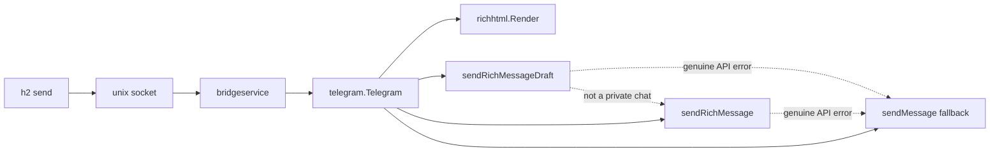
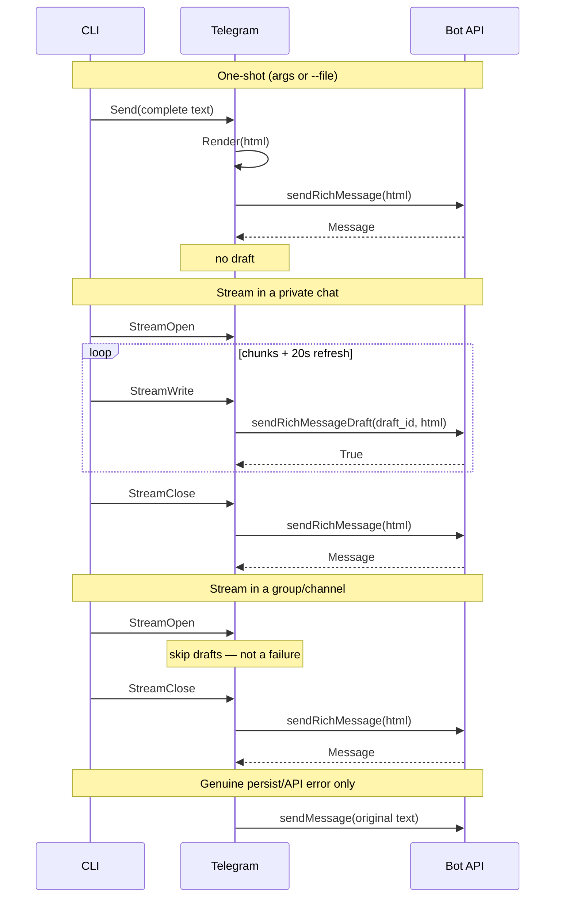
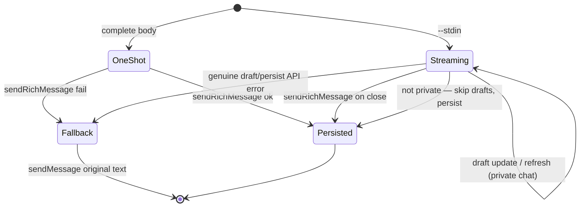

# Design: Bot API rich drafts as the only outbound Telegram path

## Summary

Outbound Telegram no longer has a `--format` flag. Every send goes through
Bot API 10.1 rich messages. Stream path:

`sendRichMessageDraft` (preview) → `sendRichMessage` (persist, get
`message_id`) → `editMessageText(rich_message)` (same message stays
rich).

A draft is **not** a message: it returns `True` and expires in 30
seconds. It cannot be edited into permanence. Persistence is always
`sendRichMessage` first; later updates of that send use
`editMessageText` with the per-stream `message_id`.

Plain `sendMessage` is retained only as a failure fallback, with the original
unmodified text. Losing a user-visible message because rich failed is the
failure mode this design exists to prevent.

Inbound photo/document handling stays gone (accepted in the revert).

## Architecture







## Facts pinned from the Bot API docs

These are not negotiable; they contradict an earlier sketch that treated a
draft as an editable message.

1. `sendRichMessageDraft` streams an ephemeral 30-second preview and returns
   `True`. You **must** then call `sendRichMessage` to persist. Type the
   call sites differently: draft → `error` only; persist →
   `(messageID int64, err error)`. Do not share a return type.
2. Draft `chat_id` is Integer and **private chat only**. Persist
   `chat_id` is Integer or String and works in groups/channels/@username.
   A non-private target means **skip drafts and persist** — that is not a
   failure and must not trigger the plain-text fallback. Only a genuine
   API error on `sendRichMessage` does.
3. `editMessageText` accepts `rich_message` and a real `message_id`. That is
   the v2 extension point for revising a persisted message. It cannot
   finalize a draft. v1 does not call it.
4. `InputRichMessage`: exactly one of `html`, `markdown`, `blocks`. We emit
   `html` only. Optional extras: `media` (ignored — we are not doing
   media), `is_rtl` (unset), `skip_entity_detection` (**always `true`**,
   a constant with a comment, not a config knob). Auto-linking file
   paths, `/commands`, and `@names` would pop Telegram's "Open this
   link?" alert.
5. Raw newlines collapse to whitespace. Structure is tags. `<div>` is not
   supported. Named entities allowed: `&lt; &gt; &amp; &quot; &apos; &nbsp;
   &hellip; &mdash; &ndash; &lsquo; &rsquo; &ldquo; &rdquo;`. Everything else
   must be numeric.
6. Limits: 32768 UTF-8 chars, 500 blocks (incl. nested / list items / table
   rows / details), 16 nest levels, 50 media attachments, 20 table columns.
7. `<tg-thinking>` is valid **only** in drafts, never in the persisted body.

## User-facing interface

No `--format`. Two ways to supply a body, same as today, plus one streaming
source:

```
h2 send telegram "hello"          # one-shot: persist only
h2 send telegram --file body.txt  # one-shot: persist only
h2 send telegram --stdin          # stream drafts, then persist
```

`--stdin` errors if stdin is a TTY (do not hang the CLI). Args/`--file` never
fake a draft by slicing an already-complete string.

## Internal API

### Renderer — `internal/bridge/richhtml`

Pure, no I/O. Heavy table-driven tests live next to it.

```go
package richhtml

type Options struct {
    Thinking bool // wrap a trailing <tg-thinking>…</tg-thinking>; drafts only
}

func Render(text string, opt Options) (html string, err error)
```

Deterministic mapping of **agent-written text with real newlines** (not full
Markdown):

| Input | Output |
| --- | --- |
| Blank-line-separated blocks | `<p>…</p>` |
| Single newline inside a block | `<br>` |
| Lines starting with `- ` or `* ` | `<ul><li>…</li></ul>` |
| Lines matching `^\d+[.)] ` | `<ol><li>…</li></ol>` |
| Fenced ` ```lang ` … ` ``` ` | `<pre><code class="language-lang">…</code></pre>` |

Inline forms on text runs only (after structure, after escaping), never
inside a fenced block. Two bounded regexes, not a Markdown parser:

| Input | Output |
| --- | --- |
| `` `code` `` | `<code>code</code>` |
| `**bold**` | `<b>bold</b>` |

Unmatched delimiters stay literal (odd number of backticks, a lone
`**`, an unclosed backtick). Nothing else is recognized: no `*italic*`,
no `__bold__`, no `***`.

Non-goals (leave as paragraph text): ATX headings, thematic breaks,
tables, blockquotes. Do not grow this into a Markdown parser.

Text-run escaping:

1. Emit only tags from the documented rich-html set (never `<div>`).
2. Escape raw `&`, `<`, `>` in text runs **after** structure is decided, so
   renderer-owned tags stay intact.
3. Then apply the two inline forms on those escaped text runs only.
4. Legal named entities pass through. Any other `&name;` is rewritten to
   `&#N;` via a bundled HTML5 named-character map; unknown names become
   `&amp;name;`.

`Render` returns an error if the result exceeds 32768 characters or 500
top-level-ish blocks (we count `<p>`, `<li>`, `<pre>`, headings we do not
emit). Caller treats that as a rich failure and falls back.

### Orchestrator — `internal/bridge/telegram`

`Sender.Send` is the one-shot path (what `bridgeservice` already calls):

```
render → sendRichMessage(html, skip_entity_detection=true) → genuine API error: sendMessage(original)
```

One-shot never drafts, so chat privacy does not matter here.

Streaming is a writer on the same type, driven by the CLI over the socket
(see below). It is **not** implemented by chunking a complete string.

```go
type Stream struct { /* draft_id, buf, lastHTML, lastFlush */ }

func (t *Telegram) OpenStream(ctx context.Context) *Stream
func (s *Stream) Write(p []byte) (int, error) // append, maybe draft
func (s *Stream) Close() error                // persist; fallback on error
```

`draft_id`: `atomic.Uint64` on `Telegram`, starting at 1, skip 0 on wrap.
Stable for the life of one `Stream`. Distinct for the next `OpenStream`.
Not a second-resolution timestamp.

Draft flush policy (200ms is a **floor**, not an extra trigger):

- Flush when there is new content **and** at least 200ms has passed since
  the last draft call. A newline is a hint that a flush is worthwhile,
  never a reason to go faster than the floor. A burst of 100 short lines
  produces a bounded number of draft calls, not 100.
- If the stream stays open with no new bytes, refresh the **same**
  `draft_id` with the last HTML at 20s so the 30s preview does not expire.
- Draft HTML may include `<tg-thinking>…</tg-thinking>` (truncated tail or
  a fixed "generating" marker). The persist call never includes it.

Streams are serialized per `Telegram` with a mutex. A second
`OpenStream` waits until the first `Close` (or abandon) finishes. Two
agents cannot animate two live drafts in the same private chat at once.

Abandoned streams: if 60s pass with no `Write`, `bridgeservice` closes
the stream through the **normal persist path** (`sendRichMessage`) so the
user still gets the content, and logs that it was abandoned. The 60s
timer uses the same fake clock as the 20s refresh.

Private vs not-private is decided at `OpenStream` (`getChat`, or a cached
type from inbound updates). If the chat is not private, `Write` does not
call draft; `Close` goes straight to `sendRichMessage`. If `getChat` is
inconclusive and the first draft returns a "not a private chat" class of
error, treat that the same way: stop drafting, persist on close. That
path is **success-shaped**, not fallback.

A genuine draft API error (anything other than not-private) abandons
rich for this send and falls back to `sendMessage` of the original
accumulated text. Same if `sendRichMessage` fails after drafts were
shown. Log the reason at `log.Printf` with the API description.
Fallback uses the existing `sendChunk` / `SplitMessage` 4096 path. If
fallback also fails, return that error — that is the only way a
message is lost.

Call sites (do not share a return type):

```go
func (t *Telegram) sendRichDraft(ctx context.Context, draftID int64, html string) error
func (t *Telegram) sendRichMessage(ctx context.Context, html string) (messageID int64, err error)
```

Every `InputRichMessage` we send sets `skip_entity_detection: true`
(package-level constant). No `media`, no `is_rtl`.

v1 does not store `message_id` on `Telegram` and does not expose
`EditRich`. A shared bridge would race two agents' ids. The user's
"same message remains rich" requirement is already satisfied by
`sendRichMessage`. `editMessageText` is the documented v2 extension
point only.

### Socket protocol — `internal/session/message` + `internal/bridgeservice`

One-shot stays `Request{Type:"send", Body, From, …}`.

Streaming adds three types so the bridge process (not the CLI) owns the
Bot API loop:

| Type | Meaning |
| --- | --- |
| `send_stream_open` | allocate `draft_id`, return `stream_id` |
| `send_stream_write` | append `Body` to that stream (may draft) |
| `send_stream_close` | persist |

The CLI `--stdin` path is the only producer of these types. `bridgeservice`
routes them to `Telegram.OpenStream` / `Write` / `Close`. Agent-tag prefix
is applied to the first write (same rule as `sendOutbound` today).

```
cmd/send  --(send)-->  bridgeservice  --Send-->  telegram
cmd/send  --(stream)-->  bridgeservice  --Open/Write/Close-->  telegram
```

`cmd` does not import `telegram`. `telegram` does not import `cmd`.
`richhtml` is imported only by `telegram` (and its tests).

## Fallback contract (most important behaviour)

Trigger fallback when **any** of these happen:

- Genuine HTTP/API error from draft or persist
- `Render` error (over limit, internal)
- Malformed markup rejected by the API

Do **not** trigger fallback when the chat is not private. Skip drafts
and persist with `sendRichMessage`.

Fallback payload is the **original unmodified text**, never the rendered
HTML. Log why. Tests must cover each failure point independently.

## Testing

All of these are unit/component tests under `make test`. None touch the real
config dir (`setupFakeHome` / `config.CheckTestIsolation` from PR #9).

| What | Where | Runner |
| --- | --- | --- |
| Renderer table (paragraphs, `<br>`, ul/ol, fences, `` `code` `` / `**bold**`, unmatched delimiters, escaping, entities, limits, no `<div>`) | `internal/bridge/richhtml/render_test.go` | `make test` |
| Property: every escaped text run round-trips through a tiny unescape of the legal set | `internal/bridge/richhtml/render_test.go` | `make test` |
| httptest Bot API: one-shot calls **only** `sendRichMessage` with `rich_message.html` | `internal/bridge/telegram/rich_test.go` | `make test` |
| httptest: stream is `N × sendRichMessageDraft` (same non-zero `draft_id`) then one `sendRichMessage` | `internal/bridge/telegram/rich_test.go` | `make test` |
| httptest: each genuine failure (draft 4xx, persist 4xx, over-limit) issues `sendMessage` with original text | `internal/bridge/telegram/rich_test.go` | `make test` |
| httptest: non-private chat skips drafts, still calls `sendRichMessage` (no `sendMessage`) | `internal/bridge/telegram/rich_test.go` | `make test` |
| Persist/draft payloads set `skip_entity_detection: true` | `internal/bridge/telegram/rich_test.go` | `make test` |
| One-shot never emits a draft | `internal/bridge/telegram/rich_test.go` | `make test` |
| `draft_id == 0` never sent | `internal/bridge/telegram/rich_test.go` | `make test` |
| Persist HTML never contains `<tg-thinking>` | `internal/bridge/telegram/rich_test.go` | `make test` |
| Burst of 100 short lines produces a bounded number of draft calls (200ms floor) | `internal/bridge/telegram/rich_test.go` | `make test` |
| 60s idle abandon persists via `sendRichMessage` and logs abandoned (fake clock) | `internal/bridge/telegram/rich_test.go` | `make test` |
| Second `OpenStream` waits until the first stream closes (serialize) | `internal/bridge/telegram/rich_test.go` | `make test` |
| `--stdin` on a TTY errors; `--stdin` from a pipe drives stream types | `internal/cmd/send_test.go` | `make test` |
| `sendOutbound` still one-shots `Sender.Send` (no format field) | `internal/bridgeservice/service_test.go` | `make test` |

`make check` (gofmt, vet, staticcheck) stays required.

## Unreasonably robust programming

- Fallback is total: every rich error path is a named test, not a shared
  helper that could skip a case.
- Draft refresh at 20s and abandon at 60s are tested with a fake clock,
  not real sleeps.
- Renderer refuses to emit unsupported tags (`<div>` included) via a
  denylist assertion on every table case's output.
- `draft_id` generator is tested across wrap (skip 0).

## Out of scope

- Inbound media (explicitly dropped).
- `--format` in any form.
- Full Markdown / CommonMark.
- Fake streaming by chunking a complete `--file` body.
- Revising a persisted message (`editMessageText` is v2 only).
- Concurrent live drafts in one chat (streams are serialized per bridge).
