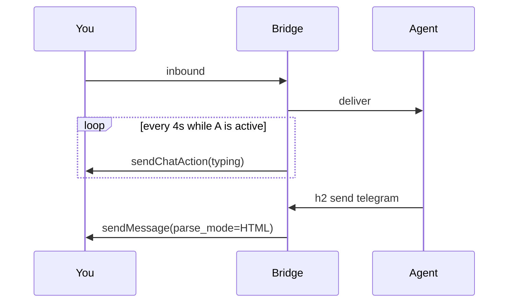

# Design: Telegram chat messages + typing

## Decision

Persist every outbound Telegram message as a **regular chat bubble**
(`sendMessage` + `parse_mode=HTML`). Never `sendRichMessage`. Never
`sendMessageDraft`.

While the last-routed agent is `active`, the existing
`runTypingLoop` sends `sendChatAction(typing)` every 4 seconds
(Telegram drops the indicator after ~5s). That is the stable blue
“typing…” row, not the alpha draft/Thinking APIs.

`--stdin` is a buffer, not a stream preview. Writes accumulate.
Close sends **one** `sendMessage`. Typing during the buffer is the
same 4s loop if the sending agent is active. No mid-stream edits.

## HTML

Agents send either Telegram **chat** HTML (`<b>`, `<i>`, `<u>`,
`<s>`, `<code>`, `<pre>`, `<a>`, `<blockquote>`, `<tg-spoiler>`)
or plain text (real newlines, `- ` / `1. ` lists, fences,
`` `code` ``, `**bold**`). Rich-only tags are downconverted.

Limit is `sendMessage`’s 4096 characters, split on newlines
(`bridge.SplitMessage`, max 3 pages).

## Fallback

If `parse_mode=HTML` is rejected, send the original unmodified text
via `sendMessage` with no parse mode.

## Files

| Piece | Path | Runner |
| --- | --- | --- |
| Chat HTML render + downconvert | `internal/bridge/tghtml/` | `make test` |
| Send / stdin buffer | `internal/bridge/telegram/rich.go` | `make test` |
| Typing loop | `internal/bridgeservice/service.go` | `make test` |
