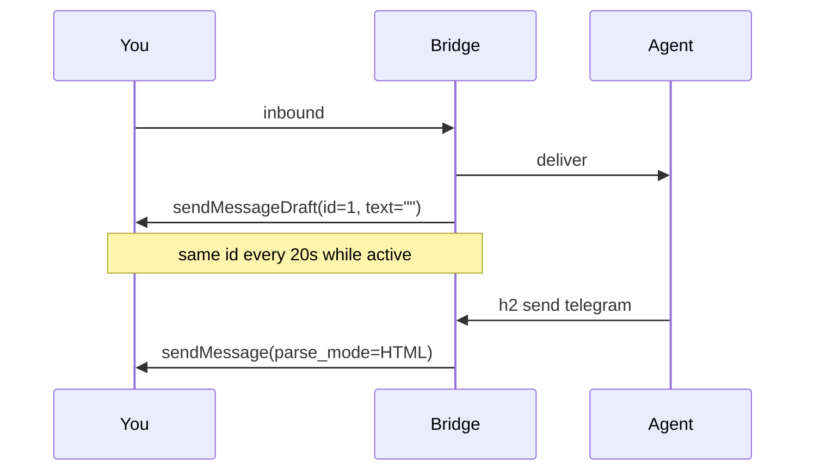

# Design: Telegram chat messages + Thinking

## Decision

Persist every outbound Telegram message as a **regular chat bubble**
(`sendMessage` + `parse_mode=HTML`). Never `sendRichMessage`.

Telegram ships two stacks. Rich messages (`InputRichMessage.html`) are a
document surface — larger type, airy spacing, list/code chrome. Regular
messages are the chat typography that already looked right. Official
Thinking exists on the regular stack: `sendMessageDraft` with empty
`text` shows a “Thinking…” placeholder; you then **must** `sendMessage`
to persist.

`--stdin` streams `sendMessageDraft` (same `draft_id=1`, growing HTML)
then persists with `sendMessage`. Later chunks of that send use
`editMessageText` on the returned `message_id`.

## Why not mix

A rich draft **must** be persisted with `sendRichMessage`. A regular
draft **must** be persisted with `sendMessage`. Mixing is illegal and
leaves the preview hanging. So Thinking and the answer share the
regular stack.

## HTML

Agents send either:

- Telegram **chat** HTML: `<b>`, `<i>`, `<u>`, `<s>`, `<code>`,
  `<pre>`, `<a>`, `<blockquote>`, `<tg-spoiler>`
- or plain text (real newlines, `- ` / `1. ` lists, fences, `` `code` ``,
  `**bold**`)

Rich-only tags (`
`, ` `, `<h1>`–`<h6>`, `<ul>`/`<ol>`/`<li>`,
tables, `<tg-thinking>`, …) are **downconverted** to chat HTML so
existing agent HTML still lands as a bubble, not a document.

Line breaks are `\n`. There are no `
` / ` ` in the persist
payload — those tags are not in the regular HTML set and would make
`parse_mode=HTML` reject the message.

Limit is `sendMessage`’s 4096 characters, split on newlines
(`bridge.SplitMessage`, max 3 pages). Split prefers `\n` so we do not
cut inside a tag when the body is our own renderer output.

## Thinking

- Inbound success → `ShowThinking` immediately (goroutine).
- Private chat: `sendMessageDraft(draft_id=1, text="")`.
- Group/channel: `sendChatAction(typing)`.
- Refresh the same draft every 20s while the agent is active (30s TTL).
- `Send`, stream open, idle, or `replyError` → `StopThinking`.
- Persist (`sendMessage`) is what dismisses the preview.

## Fallback

If `parse_mode=HTML` is rejected, send the **original unmodified text**
via `sendMessage` with no parse mode. Same if render/downconvert fails.

## Files

| Piece | Path | Runner |
| --- | --- | --- |
| Chat HTML render + downconvert | `internal/bridge/tghtml/` | `make test` |
| Send / draft / stream | `internal/bridge/telegram/rich.go` | `make test` |
| Inbound → thinking | `internal/bridgeservice/service.go` | `make test` |

## What we deleted from the previous attempt

`sendRichMessage`, `sendRichMessageDraft`, `InputRichMessage`,
`<tg-thinking>`, `skip_entity_detection`. Those were the document
path. The stream/thinking *control flow* (one draft id, 200ms floor,
20s refresh, 60s abandon, serialize behind `streamMu`, getChat
outside the lock, `${TELEGRAM_BOT_TOKEN}` expand) stays.
