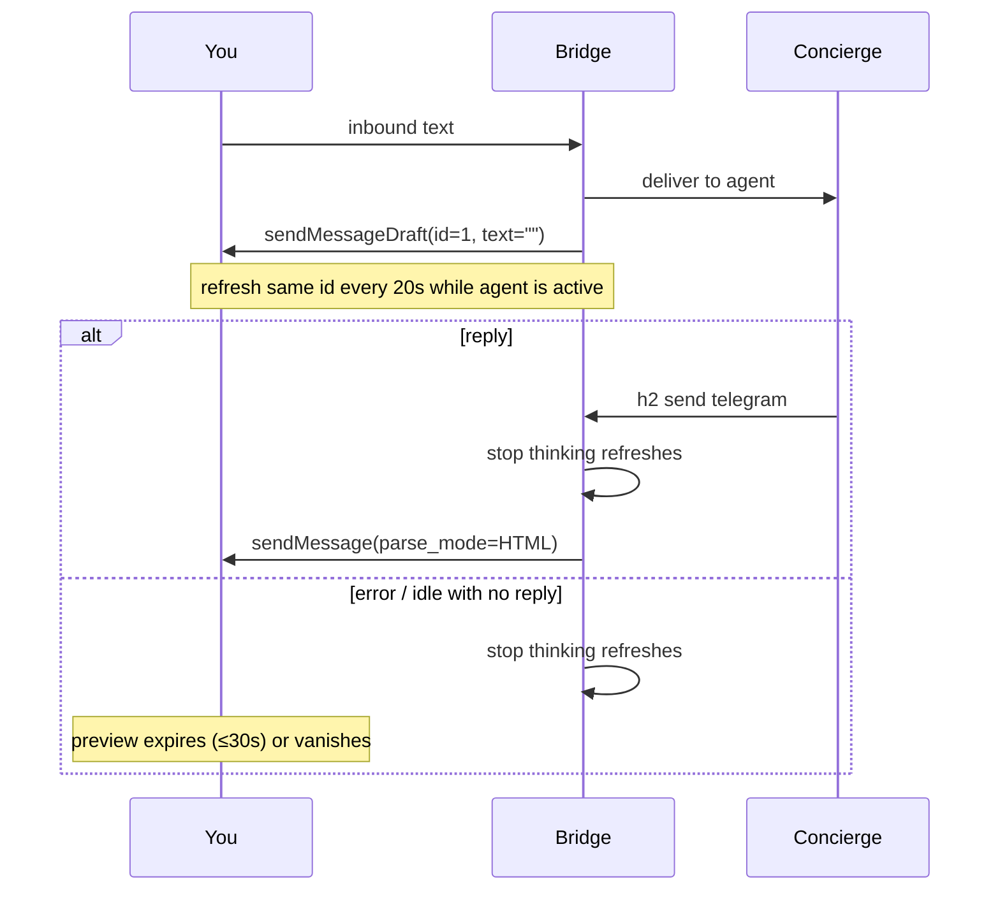

# Design: Telegram “Thinking…” while the agent is working

Canonical send path: [design-telegram-chat-send.md](design-telegram-chat-send.md).

## What you see

```
You:          What's the status on the bridge?
Telegram:     Thinking...                  ← immediately, one preview
              … 3 seconds or 30 minutes …
Telegram:     Bridge is up. PID 12.        ← regular chat bubble
```

Thinking is `sendMessageDraft` with **empty `text`** (Bot API 10.0).
The answer is `sendMessage` + `parse_mode=HTML`. Same `draft_id=1`.
A draft is not a message and cannot be edited into permanence.

In a group or channel, Telegram cannot show that draft. You only get
the header “typing…” indicator.

## Sequence



## Start / stay / stop

- After `sendToAgent` succeeds: `ShowThinking` in a goroutine.
- Refresh the same `draft_id` every 20s while the agent is `active`.
- Stop on `Send`, stream open, `replyError`, or idle.
- There is no delete-draft method. Persist is what dismisses the preview.
- Non-private / draft error → `sendChatAction(typing)`.

## Tests (`make test`)

- Inbound success → one `sendMessageDraft` with empty text and
  `draft_id == 1`, before the agent is polled as active.
- `Send` → `StopThinking` then `sendMessage` with `parse_mode=HTML`.
- Non-private → typing, no draft.
- Tests never touch the real config dir.
