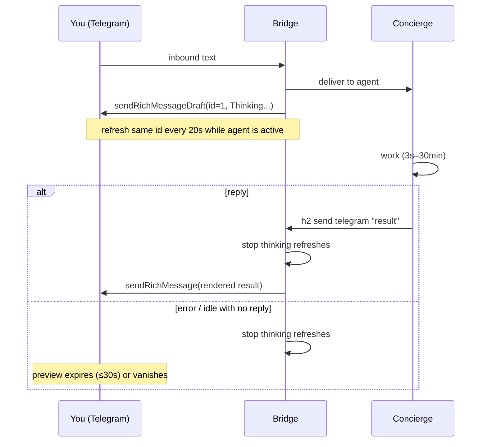

# Design: Telegram “Thinking…” while the agent is working

## What you see

```
You:          What's the status on the bridge?
Telegram:     Thinking...                  ← immediately, one preview
              … 3 seconds or 30 minutes …
Telegram:     **Bridge is up.** PID 12.    ← real reply; Thinking goes away
```

On error (agent dead, send failed, agent crashes to idle with no reply):

```
You:          What's the status?
Telegram:     Thinking...
Telegram:     Thinking... disappears        ← no extra error bubble unless
                                              we already send one today
```

In a group or channel, Telegram **cannot** show that draft. You only get
the small header “typing…” indicator. Same start/stop rules.

Agents still write `h2 send telegram "plain text"`. They never mention
drafts, HTML, or Thinking.

## Why this is not “edit the Thinking message into the answer”

`sendRichMessageDraft` returns `True`, not a `message_id`. It is a
30-second preview. The Bot API says you **must** `sendRichMessage` to
persist. So Thinking is a **preview overlay**, and the answer is a
**new persisted rich message**. Clients may hide the preview when the
real message arrives; we cannot promise a single bubble that morphs.

We do **not** use `editMessageText` for this.

## Sequence



## Start (immediate)

Today Thinking waits on a 4s poll and on `state == active`. That is
too late.

Change: in `handleInbound`, **after** `sendToAgent` succeeds, call
`ShowThinking` in a **goroutine** (do not delay delivery). Set
`lastRoutedAgent` first, same as now.

If there is no target / agent down: no Thinking; keep the existing
error reply.

## Stay up (3s–30min)

Keep a `thinking` flag on the Telegram bridge (or on the service).

While `thinking && agent state == active`, refresh the **same**
`draft_id` (`1`) at **20s** (draft TTL is 30s). Do not refresh every
4s — that is extra API noise.

If the agent flips to `idle` (or the socket dies): treat as **stop**.

Long jobs only keep Thinking if the agent stays `active` (thinking,
tool use, permission). That is the same definition we use for typing
today. If a job goes idle while still “working”, Thinking will stop;
that is existing state-machine behavior, not new.

## Stop

Call `StopThinking` when **any** of these happen:

1. Outbound `Send` of a real reply (the answer).
2. `replyError` (cannot deliver, agent not running).
3. Typing loop sees the target is no longer `active`.

`StopThinking`:

- Clear the `thinking` flag so refreshes stop.
- Best effort: one last `sendRichMessageDraft` with empty / no
  `<tg-thinking>` **or** simply stop refreshing. There is **no**
  documented “delete draft” method. Expect up to ~30s leftover if
  the client does not hide the preview when `sendRichMessage` lands.
- Never send a fake “done” chat message just to clear Thinking.

`Send` always stops thinking **before** persist, so we do not refresh
Thinking over the answer.

## Fallback

| Situation | What you see |
| --- | --- |
| Private chat, draft OK | “Thinking…” preview |
| Group / channel | header “typing…” only |
| Draft API error | header “typing…” |
| Rich persist of the answer fails | plain `sendMessage` of the original text (already implemented) |
| Agent never replies, goes idle | Thinking stops; no extra message |

## What we do **not** need for this UX

- `--stdin` and `send_stream_*`
- Mid-stream `editMessageText`
- Agents writing HTML or `--format`

Those can stay in the tree for later or be deleted in a cleanup PR.
They are not part of this loop.

## Code seams

| Piece | Where |
| --- | --- |
| Start | `bridgeservice.handleInbound` after successful `sendToAgent` |
| Refresh / idle-stop | `runTypingLoop` (20s while `thinking && active`) |
| Stop on answer | `Telegram.Send` (and any `sendPlain` fallback) first line |
| Stop on error | `replyError` |
| API | `ShowThinking` / `StopThinking` on `ThinkingPreview` |

## Tests (`make test`)

- Inbound success → one `sendRichMessageDraft` with
  `<tg-thinking>Thinking...</tg-thinking>` and `draft_id == 1`, **before**
  the agent is polled as active.
- Inbound failure → no thinking draft.
- While active, a 25s fake-clock advance → another draft, **same** id.
- Idle → `StopThinking`, no further drafts.
- `Send` → `StopThinking` then `sendRichMessage` (no thinking tag in
  persist).
- `replyError` → `StopThinking`.
- Non-private → `sendChatAction typing`, no draft.
- Tests never touch the real config dir.

## Look (what to expect in the client)

- **Thinking...** should feel like Telegram’s own AI “thinking” row
  (italic / dim / spinner — whatever the client does with
  `<tg-thinking>`).
- The answer is a normal incoming message under it, rendered from
  plain text (bold, code, lists).
- You may briefly see both, or Thinking lingering after the answer,
  because we cannot delete a draft. If that looks bad in the real
  client after cutover, we tune stop (e.g. last empty draft) — that
  is a display tweak, not a second architecture.
