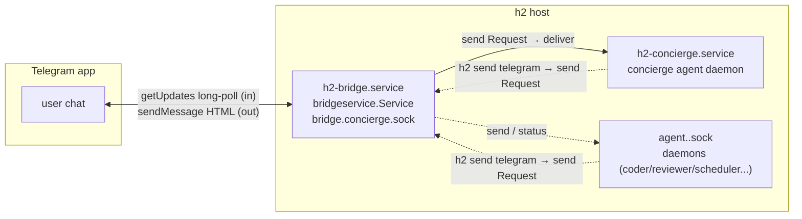

# Telegram Mini App — TUI stream discovery + design (h2ops-5nj.1)

**Status:** DISCOVERY + DESIGN ONLY. No code was written or changed for this
task; no live service was touched. Companion to the pre-existing design
`docs/plans/telegram-tui-miniapp.md` (+ test plan) on branch
`feat/telegram-tui-miniapp-plan` — this doc records what actually exists on
disk today and evaluates streaming options against that reality.

**Scope of task h2ops-5nj.1:** locate the mini-app code, document the current
architecture as found, compare streaming approaches (polling vs WebSocket vs
bridge event tap), recommend one, list risks/open questions.

---

## 1. As-found: there is no implemented mini-app

A full search under `/home/ubuntu/h2home/projects` (and all 11 h2 git
worktrees) finds **zero shipped mini-app code**: no `Telegram.WebApp` usage,
no `initData` validation, no `xterm.js`, no `setChatMenuButton`, no static SPA
assets, no HTTP server in the bridge. The name "mini-app" exists only as:

- **Design docs, already committed** on branch `feat/telegram-tui-miniapp-plan`
  (checked out at worktree `/home/ubuntu/h2home/worktrees/concierge-plan`,
  commit c09f986):
  - `docs/plans/telegram-tui-miniapp.md` — full design: attach socket →
    WebSocket → xterm.js SPA, initData HMAC auth, owner allowlist,
    Cloudflare Access, planned module tree (`internal/tuistream/`,
    `webapp-src/`). Explicitly gated ("do not implement until an Ox scheduler
    stands in the pod AND the opencode→crush cutover is complete"; user
    directive dated 2026-08-23).
  - `docs/plans/telegram-tui-miniapp-testplan.md` — e2e/security/load/manual-QA
    harness plan.
- Branch tip is exactly one docs commit ahead of its merge-base with `main`;
  nothing else was ever built from it.

So "current architecture" = the surrounding Telegram bridge stack the planned
mini-app must plug into, below. All file refs are against `main`
(499a7bb) unless noted.

## 2. Current architecture as-found

### 2.1 Processes and sockets

- **Bridge process** (`ops/units/h2-bridge.service.new`): runs
  `h2 bridge --bridge telegram --set-concierge concierge`. One-shot systemd
  unit, `RemainAfterExit=yes`, `EnvironmentFile=-/home/ubuntu/h2home/.secrets.env`.
  Freshly cut over in the fgh.4 unit split (bridge-only; concierge separated to
  avoid an OOM loop) — **do not restart it casually**.
- **Socket registry** (`internal/socketdir/socketdir.go`): everything is a Unix
  domain socket named `<type>.<name>.sock` in `<H2_DIR>/sockets/`; types today:
  `agent` and `bridge`. Discovery = `socketdir.ListByTypeIn(dir, type)`
  (socketdir.go:187). There is no TCP/HTTP listener anywhere in the product.
- **Bridge service** (`internal/bridgeservice/service.go`): hosts bridges,
  listens on `bridge.<name>.sock`, routes inbound chat text to agents
  (prefix `name:` → reply-to tag → concierge fallback, service.go:207),
  forwards outbound agent sends to Telegram, runs a typing loop while the last
  routed agent is active, tracks streams for rich-draft-style incremental sends.

### 2.2 Agent-side comms surface (what a mini-app could reuse)

| Surface | Entry point | Notes |
|---|---|---|
| **Attach (live TUI)** | agent socket `Request{Type:"attach", Cols, Rows, OscFg, OscBg, ColorFGBG}` then framed read | Frame format `[1B type][4B BE len][payload]`, `FrameTypeData=0x00` raw VT bytes, `FrameTypeControl=0x01` JSON (`ResizeControl`, `SwitchControl`) — `internal/session/message/protocol.go:194-213,263`. Reference client: `internal/cmd/attach.go:166` (`dialAndAttach`) — dial via `socketdir.Find(name)`, send attach, then loop `ReadFrame` writing payload to stdout. This is a byte-exact terminal stream incl. 24-bit color. Multiple attachers supported; input flows back as plain stdin bytes over the same socket. |
| **Status snapshot** | `Request{Type:"status"}` | Returns `AgentInfo` JSON: state/sub_state, uptime, tokens/cost, tool counts, git stats (`protocol.go:131`). Helper: `message.QueryAgentInfo` (protocol.go:217). Same data feeds `h2 list` / statusbar. |
| **Agent event log** | per-session `events.jsonl`, append-only | `internal/session/agent/shared/eventstore/store.go`; typed events (`EventToolStarted`, `EventApprovalRequested`, `EventAgentMessage`, ... — monitor/events.go:18). Read side: `h2 peek` (last N events). Durable, survives restarts. |
| **Bridge send/stream** | bridge socket `send` / `send_stream_open/write/close` | Outbound text only. Telegram `Send` renders HTML and persists as regular chat bubbles (`internal/bridge/telegram/rich.go:27`); drafts/rich_message were removed by decision (docs/design-telegram-chat-send.md). 4096-char limit, max 3 pages. |

### 2.3 Telegram bridge specifics

- Inbound: single long-poll loop on Bot API `getUpdates` (30 s timeout,
  exponential backoff to 60 s — telegram/telegram.go:93). Filters to the one
  configured `chat_id`; slash commands whitelist (`allowed_commands`),
  otherwise routed to agents as prose.
- Outbound: `sendMessage` with `parse_mode=HTML` via `tghtml` converter, plain
  fallback; typing indicator via `sendChatAction` every ~4 s while target
  active.
- Config block `bridges.telegram` in `config.yaml`: `bot_token`, `chat_id`,
  `allowed_commands`, `expects_response` (config.go:33). Bot token also
  mirrored via `/home/ubuntu/h2home/.secrets.env` (path only; contents not
  read, per redaction rule).
- **No web-app surface exists**: the bridge has no `setChatMenuButton`,
  no inline `web_app` buttons, and holds no HTTP endpoint a Mini App could hit.

### 2.4 Existing deployment facts relevant to hosting

- cloudflared tunnel already fronts home-in-cloud services (per the prior
  design doc); Cloudflare Access available as edge authN.
- The fgh.4 split just moved concierge out of the bridge unit for memory
  reasons; any new always-on component should be a separate unit/process, not
  another responsibility inside the freshly-stabilized bridge.

---

## 3. Streaming options for a TUI-style view in a Mini App

Goal restated: in a Telegram Mini App (webview), show something that feels like
the agent's TUI. Three families of transport, evaluated against the surfaces
above. (Auth/hosting concerns are common to all three and summarized in §5.)

### Option A — Polling snapshots (Bot API or self-hosted HTTP)

Periodically fetch state and re-render: either edit a Telegram message via the
Bot API (text/PNG screenshot), or have the SPA poll `GET /api/status` +
`GET /api/events?since=` every 1–3 s and render cards/log lines.

- Pros: simplest possible client; works even without a persistent socket;
  trivially cacheable; no server push infra.
- Cons: **feels dead** for a TUI. Bot API route hits the documented ~30
  req/s global bot ceiling and per-chat edit throttles; the prior design
  explicitly dropped PNG/text-snapshot fallbacks for this reason
  (telegram-tui-miniapp.md §1). Self-hosted polling still burns battery on
  mobile, has seconds-level latency, loses color/spinner animation fidelity,
  and needs since-cursors and gap repair logic anyway.
- Fit: fine as a *fallback* view (agent list screen already fits this model);
  wrong tool for the live terminal pane.

### Option B — WebSocket proxy of the attach protocol (live VT bytes)

The planned path: a small gateway dials the agent's attach socket, pumps
`FrameTypeData` payloads verbatim as binary WS frames into xterm.js in the
Mini App; keystrokes/resize flow back (gated). This is exactly what
`telegram-tui-miniapp.md` specifies (`internal/tuistream/`, two planes:
HTTPS control plane for agent list/session tokens, WS data plane).

- Pros:
  - Zero agent-side work — the protocol already serves multiple concurrent
    attach clients with full-fidelity VT bytes (colors, box drawing, cursor,
    scrollback).
  - Real-time (<250 ms glass-to-glass achievable); binary pass-through means
    one copy per frame, no re-encode (E1 in prior doc).
  - Backpressure story is tractable: latest-wins coalescing keeps slow phones
    current (E2), and the escape-hatch "terminal-diff coalescing" idea (A1)
    has a clean upgrade path.
  - Reuses battle-tested pieces (`socketdir.Find`, `message.ReadFrame`,
    `QueryAgentInfo` for the list screen).
- Cons:
  - New always-on network listener in the security perimeter (initData HMAC
    validation, owner allowlist, short-TTL session tokens, CSP/origin checks —
    prior doc §4 is the right shape).
  - Raw VT bytes are opaque: no server-side notion of "what's on screen"
    (matters if we ever want redaction/search — see risks).
  - More moving parts than polling: WS lifecycle, reconnect/resume semantics,
    coalescing buffer.

### Option C — Bridge event tap (structured events over WS/SSE)

Extend the *bridge* (or a sibling process) to subscribe to agent activity —
the `events.jsonl` stream / monitor events — and push structured JSON events
(tool started/completed, messages, state changes, approvals) to the Mini App
over SSE/WebSocket, rendering a "timeline/log" UI instead of a literal
terminal grid. Keystroke return would go through existing `send` routing.

- Pros:
  - Structured data is safe to render, filter, and store; natural fit for a
    phone-sized screen (cards, not 80×24); enables notification-worthy
    semantics (approval requested!) that raw VT bytes hide inside ANSI soup.
  - Doesn't expose a live PTY at all — strictly smaller blast radius than B;
    input can reuse the audited inbound-message path instead of raw stdin.
  - Event sources exist today (`eventstore.Append`, monitor events); a tap is
    mostly fan-out plumbing.
- Cons:
  - Not the actual TUI: spinners, full-screen redraws, vim/htop-like panes
    don't survive structuring; fidelity is permanently capped.
  - Coverage gaps: events capture harness-level activity, not arbitrary PTY
    output; anything the harness doesn't emit simply won't appear.
  - Requires new tap wiring in the session daemon (or tailing files), i.e.
    agent-side change — the thing option B avoids entirely.

### Quick comparison

| Criterion | A polling | B WS attach proxy | C event tap |
|---|---|---|---|
| Feels live | ✗ (seconds) | ✓ (<250 ms) | ✓ (sub-second) |
| TUI fidelity | ✗ | ✓ exact VT | partial |
| New agent-side code | none | none | yes (tap) |
| New exposed surface | small | HTTPS+WS (auth-heavy) | HTTPS+SSE (auth-light-ish) |
| Input path | n/a / chat | raw PTY (dangerous, gateable) | structured send (safer) |
| Server complexity | low | medium-high | medium |
| Phone battery/data | poor | good | good |

## 4. Recommendation

**Adopt Option B (WebSocket proxy of the attach protocol) as the primary
streaming path — it matches the existing gated design and needs zero
agent-side changes — with two amendments, and keep Option A's status-polling
shape for the agent-list screen and degraded mode.**

Tradeoffs accepted:
- We take on the full auth burden (initData HMAC, owner allowlist, TTL'd
  session tokens, strict origin/CSP) before first ship; this is unavoidable
  for *any* live-view variant that shows real terminal content, and the prior
  doc's layered plan (§4) is sound and testable.
- View-only first (prior doc Q3 lean): v1 ships read-only; keystroke arming
  deferred until negative tests S4/S5 exist. If interactive input ever feels
  too risky long-term, Option C's structured-send path is the safer input
  channel and can be added alongside without disturbing B's read path.
- Do NOT put the tap (C) in the freshly-cut-over bridge process. If C is
  pursued later (approvals/timeline UX), run it as its own unit reading
  `events.jsonl`, so the bridge stays a thin router.

Amendments to the existing design worth making when implementation opens:
1. **Reconnect/resume is underspecified** in the prior doc: define
   client-reconnect behavior (re-dial attach; optionally replay last N bytes
   or accept a blank screen) and add a WS close code taxonomy (agent ended /
   idle timeout / auth expired) to the test plan F5.
2. **SSE fallback** for restrictive networks/proxies is cheap to add later but
   shouldn't block v1; binary WS remains the contract.

## 5. Risks

1. **Exposes a live host terminal to a public webview.** In-frame secrets
   cannot be scrubbed; the entire mitigation is channel confidentiality +
   owner-only access. Any auth shortcut (skipped Access policy, stale token
   check, permissive Origin) is a host-compromise vector. Highest-risk item
   in the whole feature.
2. **initData replay window**: Telegram signs `initData` but it must be
   freshness-checked (`auth_date` max age); getting this wrong allows
   replayed identity. Needs fuzz tests (prior doc U2).
3. **Interactive mode = arbitrary command execution** on the host. Even gated
   behind a toggle + scoped tokens, a stolen session token during an armed
   window is game over. Recommend default-off forever, hard TTL on armed
   sessions.
4. **Backpressure/VT corruption**: naive drop-olives under load corrupts
   escape-sequence state on the client; coalescing must be latest-wins at
   frame granularity, and even that can tear mid-sequence (see A1 diff
   fallback in prior doc).
5. **Operational coupling risk**: adding an HTTP listener to the host widens
   the incident surface right after a delicate unit-split cutover; a crash
   loop or port conflict in the new gateway must not take down bridging
   (argues for separate process/unit, prior doc Q1).
6. **Secrets hygiene during build**: bot token lives in config.yaml and
   `.secrets.env`; the gateway needs it for HMAC validation. Must come from
   the env-file path only, never logged, never baked into the SPA.

## 6. Open questions for the user

1. **Gate status**: the existing design forbids implementation until (a) an Ox
   scheduler stands in the pod and (b) the opencode→crush cutover is fully
   done. Both now appear true (crush pod running, fgh.4 cutover landed). May
   implementation planning start, or does the user want the gate held longer?
2. **View-only vs input in v1**: confirm view-only first (recommended here),
   and whether interactive keystrokes should ship at all in v2 or stay
   desktop-only permanently.
3. **Hosting preference**: serve the SPA + gateway from the host behind the
   existing cloudflared tunnel + Cloudflare Access (assumed), or host the
   static SPA on Cloudflare Pages with the API still host-side?
4. **Process topology**: dedicated `h2 tuistream` subcommand/unit (lean yes,
   isolation after the fgh.4 OOM lessons) vs hosted inside the bridge process?
5. **Timeline UX (Option C)**: is a structured "approvals/activity timeline"
   interesting as a follow-up screen, or is the raw terminal the whole point?
   Affects whether we invest in an event-tap now or never.
6. **Bot token source for HMAC validation**: confirm reading from the
   `.secrets.env` environment-file pattern (not `config.yaml`) is acceptable
   for the new gateway, matching the bridge unit's convention.

---

*Discovery performed read-only against main@499a7bb (plus the
feat/telegram-tui-miniapp-plan docs branch). Live units untouched; no secrets
read or included.*
