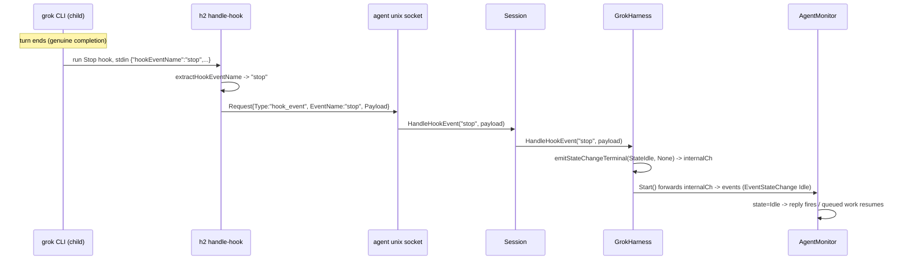

# Grok Stop-hook harness wiring

## Summary

The Grok Build harness (`internal/session/agent/harness/grok`) currently detects
idle/active purely from PTY output timing via `ptycollector`, exactly like the
generic harness. The deployed binary went further and layered *TUI screen-marker
classification* on top of the collector. When xAI shipped a new Grok Build TUI the
markers stopped matching, so the harness got stuck in `state=active` forever: replies
never fired back and queued work was never picked up (daemon.stderr:
`grok screen unmatched by known TUI markers (holding state=active)`). Restarting did
not help — it just re-wedged.

Grok Build exposes the **same lifecycle-hook mechanism as Claude Code** (documented in
`~/.grok/docs/user-guide/10-hooks.md`): a `Stop` hook that fires "when an agent turn
ends on a genuine completion", plus `StopFailure`, `StopCancelled`, and a
`Notification`/`idle_prompt` backstop. h2 already has a complete, agent-agnostic hook
transport: the child CLI runs `h2 handle-hook`, which dials the agent's unix socket and
forwards a `hook_event` request that the session routes into
`Harness.HandleHookEvent`. Claude uses this to emit a non-lossy `StateIdle` transition
on `Stop`.

This change puts Grok **in exactly the same position as the Claude agents h2 already
runs**: event-driven turn-completion detection over the existing hook transport,
instead of scraping the TUI. The `ptycollector` remains as a fallback safety net, so a
missed hook still eventually settles to idle.

We deliberately use hooks (not headless `-p`): hooks keep the interactive TUI + the
consumer OAuth subscription + `h2 peek`, and stay on the same footing Anthropic
explicitly blesses for `claude -p` on Max. Headless NDJSON re-introduces the xAI
consumer-ToS "using bots to access" gray area.

## Architecture

## Key differences from Claude (why the wiring is not a drop-in)

1. **Event-name key casing.** Claude's hook stdin envelope uses
   `hook_event_name` (snake); Grok uses `hookEventName` (camel). `h2 handle-hook`
   only parsed the snake key. Fix: `extractHookEventName` tries `hook_event_name`
   then `hookEventName`. Transport stays agent-agnostic; downstream dispatch is
   per-harness.
2. **Event-value casing.** Claude's values are PascalCase (`Stop`); Grok's are
   snake_case (`stop`, `user_prompt_submit`, `stop_failure`, `stop_cancelled`,
   `notification`, `session_end`). `GrokHarness.HandleHookEvent` matches Grok's
   vocabulary.
3. **Config location + schema.** Claude reads `settings.json` under
   `CLAUDE_CONFIG_DIR`. Grok reads `*.json` from `$GROK_HOME/hooks/` (always-trusted
   global scope; `GROK_HOME` overrides `~/.grok`). Same `{"hooks": {Event: [{matcher,
   hooks:[{type,command,timeout}]}]}}` shape.
4. **Subagent events.** Grok fires `Stop`/`StopCancelled` inside subagents too,
   carrying `subagentType`. A subagent's stop is **not** the session's idle, so we
   drop any event with a non-empty `subagentType`.
5. **Notification backstop.** Registered with `matcher: "idle_prompt"` so only the
   idle ping reaches us; treated as a settle-to-idle backstop for turns that report
   none of the three stop events.

## Components changed

- `internal/cmd/handle_hook.go` — `extractHookEventName([]byte) (string, error)`
  accepting both key casings; used in `RunE`. Grok's non-Claude events
  (`pre_tool_use`, `stop`, …) fall through to the existing "return `{}`" passive path,
  so hooks never block a Grok turn.
- `internal/config/grok_config.go` (new) — `EnsureGrokConfigDir(configDir)` +
  `buildGrokHooks()`. Reuses `hookEntry`/`hookMatcher` from `session_dir.go`. Writes
  `$GROK_HOME/hooks/h2.json` idempotently. Registers `UserPromptSubmit` (busy),
  `Stop`/`StopFailure`/`StopCancelled` (settle), `SessionEnd` (teardown settle), and
  `Notification` matcher `idle_prompt` (backstop). Command `h2 handle-hook`, timeout
  10s (passive; exits 0 so the Stop gate never blocks).
- `internal/session/agent/harness/grok/harness.go` —
  - `internalCh chan monitor.AgentEvent` (buffered 256), created in `New`.
  - `Start` selects over `collector.StateCh()`, `internalCh`, and `ctx.Done()`,
    forwarding both sources. Ptycollector kept as fallback.
  - `EnsureConfigDir` now also calls `config.EnsureGrokConfigDir`.
  - `HandleHookEvent` maps Grok event values to `AgentEvent`s via `emit`/
    `emitTerminal` (mirrors Claude's non-lossy terminal emit so `Idle` is never
    dropped under backpressure): `user_prompt_submit` → Active/Thinking; `stop`,
    `stop_failure`, `stop_cancelled`, `notification`(idle_prompt) → Idle (terminal);
    `session_end` → EventSessionEnded (terminal). Drops events with `subagentType`.

## Non-lossy guarantee (URP)

The `Stop → Idle` transition is emitted with `emitTerminal`, which tries non-blocking,
then blocks up to 2s, then makes a last-resort non-blocking attempt before logging a
drop — identical to Claude's `terminalEmitTimeout` path. This is what prevents the
h2-wkg class of bug where a dropped Idle leaves `IsIdle=false` and withholds messages
forever. The `ptycollector`/`maybeReconcileIdle` watchdog is retained as a second,
independent safety net: even a totally missed hook eventually reconciles to idle.

## Testing

- `internal/cmd/handle_hook_test.go` — `TestExtractHookEventName`: snake-only,
  camel-only (`{"hookEventName":"stop"}` → `stop`), both-present prefers snake, missing
  → error. Existing behavior tests unchanged.
- `internal/session/agent/harness/grok/harness_test.go` — replace the
  `HandleHookEvent_Unsupported` test: `stop`/`stop_failure`/`stop_cancelled`/
  `notification` → EventStateChange{Idle,None} on internalCh; `user_prompt_submit` →
  EventUserPrompt + EventStateChange{Active,Thinking}; `subagentType` present → returns
  true, no event; unknown value → false; `session_end` → EventSessionEnded; `Start`
  forwards an internalCh event to the external channel.
- `internal/config/grok_config_test.go` (new) — `EnsureGrokConfigDir` writes
  `hooks/h2.json` with the six registrations, `Notification` carrying `matcher:
  "idle_prompt"`, command `h2 handle-hook`; idempotent (does not overwrite an existing
  file). Uses `t.TempDir()` (no `ConfigDir()`).

All roll up into `make test`; gated by `make check` before commit.

## Follow-ups / caveats

- If a Grok role ever registers its own **blocking** `Stop` gate, the passive `Stop`
  observer would settle idle on each continuation fire. h2 roles do not run Stop gates
  today; if that changes, drop `Stop` from the writer and rely on `Notification`
  idle_prompt + `SessionEnd`. Documented here so the trade-off is explicit.
- Verification launches a managed Grok agent through h2 (normal operation), confirms
  the Stop hook drives idle + reply-back — this exercises the harness, not the
  forbidden headless `-p` ToS probe.
