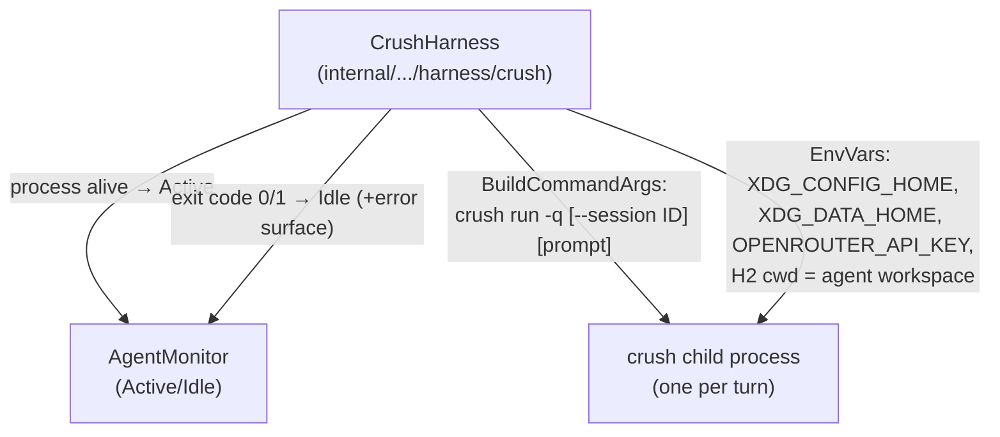

# Design Doc: Crush Harness for h2

Status: DRAFT (findings verified, awaiting review) — 2026-08-23
Owner: coder-ox · Reviewer: concierge
Related: `docs/plans/opencode-harness.md` (template + opencode comparison),
`internal/session/agent/harness/{claude,codex,generic,grok}`

## 1. Summary

Add **Crush** (Charmbracelet, Go — same lineage as opencode) as an h2 harness as
the lightweight replacement for the opencode/Bun track (~600 MB RSS/agent).
Verified on this box with the Ox Alpha stealth model via OpenRouter:

| Question (from tasking) | Answer |
|---|---|
| **(a) Does Ox Alpha work via Crush?** | **Yes.** `openrouter/stealth/ox-alpha` is in Crush's model catalog; base_url `https://openrouter.ai/api/v1`; key from `OPENROUTER_API_KEY` env. Text turns, tool-calling (file creation via client-executed tools), and multi-turn (`--session <id>`) all verified end-to-end. |
| **(b) Memory** | `crush run` one-shot turn: ~26 MB at start → **peak ~90 MB** during a turn. `crush server`: **~64 MB idle**. Process fully exits after a run-mode turn (nothing lingers). vs opencode ~600 MB → **4 agents ≈ 350–400 MB total**, fits the box. |
| **(c) Turn-done mechanism** | **Exec/one-shot mode**: `crush run "<prompt>"` exits when the turn completes. Exit code 0 = success, 1 = error; final assistant text on stdout (clean with `-q`), errors on stderr. This is a *real process exit* — strictly stronger than opencode's `session.idle` plugin event, and no screen scraping. |
| **(d) Isolation** | Full XDG support verified: per-agent `XDG_CONFIG_HOME`/`XDG_DATA_HOME` give separate config + provider state; sessions live per-project in `<project>/.crush/crush.db` (SQLite); `--data-dir` overrides that. Two concurrent agents with disjoint state verified working. |

Install: Crush v0.91.0 single static Go binary from GitHub releases, installed
at `/usr/local/bin/crush` (~28 MB download). Pin this version.

## 2. The one decision that matters: turn-done detection

Same framing as the opencode doc: h2 only delivers queued messages while an
agent is Idle.

- Crush v0.91.0 hooks support **only `PreToolUse`** (verified in schema +
  upstream docs). There is **no Stop/session.idle hook yet**, so the
  claude/opencode-style hook bridge is *not available today*.
- Therefore the harness uses **exec mode**: each h2-delivered message becomes
  one `crush run --session <id> "<message>"` process. Running = Active;
  process exit (code) = Idle. No TUI, no scraping, no silence-heuristics.
- Session/context continuity across turns is native and machine-readable:
  `crush run --session <id>` / `--continue`; `crush session list --json`
  returns ids/titles/timestamps. State persists in `<project>/.crush/crush.db`.

This maps to the codex/generic harness shape (child process lifecycle IS the
state machine) rather than the claude hook shape. If Crush later ships a Stop
hook, we can add an interactive-TUI variant behind the same Harness interface
without changing monitor semantics.

## 3. Architecture (harness sketch)



Per-turn data flow:
1. h2 delivers message → harness spawns `crush run -q --session <sid> <text>`
   with cwd = agent workspace dir → emits Active.
2. Model works (client-executed function tools run inside crush, permissioned
   by config — see §4). Harness waits on process exit.
3. Exit 0 → emit Idle; stdout is the reply text (already clean, `-q` suppresses
   spinner). Exit ≠ 0 → Idle + stderr surfaced to activity log (verified error
   text is actionable, e.g. OpenRouter 402).

## 4. Verified configuration (the important gotcha)

**Gotcha:** Crush's catalog default `max_tokens` for ox-alpha is 64000.
OpenRouter rejects requests when the credit balance can't cover worst-case
cost: HTTP 402 *"payment required … You requested up to 64000 tokens, but can
only afford 1826"*. Reproduced consistently (big system+tool prompt); direct
curl with tiny prompt passed. Fix verified — pin output tokens in the model
slots:

`$XDG_CONFIG_HOME/crush/crush.json` (**minimal working config**):
```json
{
  "$schema": "https://charm.land/crush.json",
  "models": {
    "large": { "provider": "openrouter", "model": "stealth/ox-alpha", "max_tokens": 4096 },
    "small": { "provider": "openrouter", "model": "stealth/ox-alpha", "max_tokens": 2048 }
  }
}
```

Notes:
- No provider block needed: `openrouter` is a known provider; auth comes from
  `OPENROUTER_API_KEY` env (config also supports literal `"$VAR"` expansion —
  never write the real key into config).
- Tool auto-approval: `--yolo` is **not accepted by `run`** in v0.91.0. Use
  config instead — verified working:
  `"permissions": { "allowed_tools": ["bash","edit","write","view","glob","grep","ls","multiedit","patch","read","todowrite","webfetch"] }`.
- Upstream docs on `main` describe a newer CLI (`crush model large …`) than
  v0.91.0 — treat https://charm.land/crush.json (the schema) as the source of
  truth for the pinned version.

Harness responsibilities (EnsureConfigDir analogue): write the above config
into the agent's `XDG_CONFIG_HOME/crush/`, checksum-guarded/idempotent like the
opencode design; inject env per agent.

## 5. Roles / isolation layout (per agent N)

```
XDG_CONFIG_HOME = ~/h2home/opencode-config/<agent>/xdg-config   # crush.json
XDG_DATA_HOME   = ~/h2home/opencode-config/<agent>/data         # provider state
cwd             = agent's project workspace                     # sessions in ./.crush/crush.db
```

- Verified: fresh XDG dirs see `[]` sessions (no leakage); concurrent runs of
  two isolated agents both succeed.
- `crush server` exists (64 MB idle) but run-mode never leaves one alive; if we
  ever adopt server mode, pass explicit `--host unix://…` per agent (default
  socket is uid-scoped `/tmp/<uid>/crush-<uid>.sock` — shared across agents).

## 6. Testing plan (mirrors opencode doc)

Unit: BuildCommandArgs (fresh/resume/model/-q), EnvVars (XDG + key),
EnsureConfigDir idempotency + max_tokens pinned; no-TUI-scrape invariant test.
Integration: stub `crush` fixture script (sleep + exit 0 / exit 1) asserting
Active→Idle transitions and queued-message delivery after idle; error-path
surfaces stderr. Manual QA: real Ox Alpha turn with tool use through
`h2 run --role crush-coder` + `h2 send`.

## 7. Open questions for review

1. Transport: exec-per-turn (recommended, matches §2) vs PTY+TUI. Exec means no
   live `h2 peek` screen content for these agents — acceptable?
2. Where replies go: exec stdout must be captured as the agent's reply channel
   (generic-harness style) — confirm `InputSender`/output plumbing supports
   capturing full stdout per turn.
3. Session id strategy: one long-lived session per agent (`--continue`) vs one
   session per task. Default proposal: `--continue` within a workspace.
4. Version pinning: apt-less box → binary path + version check in harness
   startup (like codex version gate)?
