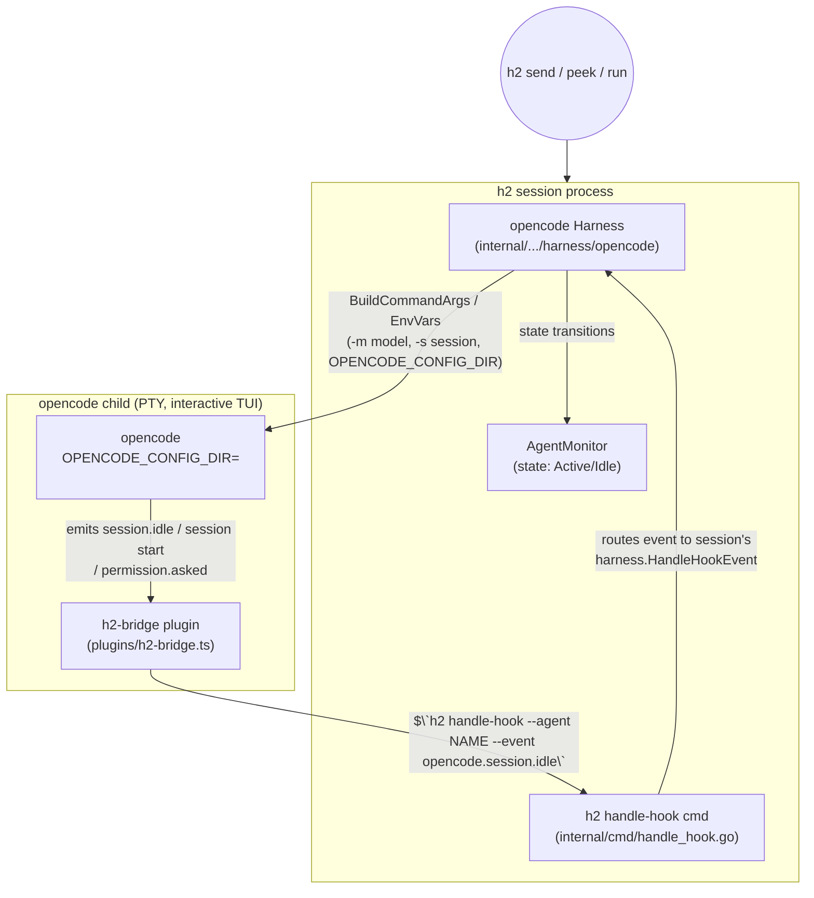

# Design Doc: opencode Harness for h2

Status: DRAFT (planning) — 2026-08-21
Owner: concierge
Related: `internal/session/agent/harness/{claude,grok,codex,generic}`, `internal/cmd/auth.go`, `internal/cmd/handle_hook.go`, `~/h2home/notes/grok-harness-followups.md`

## 1. Summary

Add **opencode** (the SST open-source terminal coding agent) as a first-class h2
harness, indistinguishable from the existing `claude`, `grok`, and `codex`
harnesses: launched via `h2 run --role <role>`, monitored by `h2 peek`, fed by
`h2 send`, authenticated via `h2 auth opencode`.

The immediate driver is running the free **Ox Alpha** stealth model
(`openrouter/stealth/ox-alpha`, free ~1 week from 2026-08-20, likely a GLM-5.3
variant, strong at agentic coding). But the design is deliberately
**model-agnostic**: opencode speaks to any provider (OpenRouter, Anthropic,
OpenAI, local, opencode-zen), so this harness becomes h2's **general-purpose
gateway to any model** — Ox Alpha today, anything tomorrow, by changing one
config field. That is the "future-proof" requirement, satisfied structurally
rather than by promise.

### The one decision that matters: turn-done detection

Everything hard about an h2 harness is answering *"has the agent finished its
turn?"* — h2 only delivers queued inter-agent messages while an agent is Idle.
There are three known strategies in the codebase:

| Strategy | Used by | Robustness |
|---|---|---|
| Screen-content classification (scrape the TUI) | grok (v1) | **Fragile** — broke when xAI shipped a new TUI; wedged `state=active` for 9h (grok Follow-up D) |
| Output-silence (ptycollector) | codex/generic | OK for TUIs that go quiet; fails on animated TUIs |
| **Structured events / hooks** | claude | **Robust** — provider emits a real "turn ended" signal |

opencode has a **native plugin event `session.idle`** — *"triggered when the
assistant finishes a turn."* This design uses it. The opencode harness is
therefore modelled on the **claude harness (hook-driven)**, NOT the grok harness
(screen-scraped). We do not scrape opencode's TUI. This is the single most
important decision in the doc and the direct lesson from the grok outage.

## 2. Architecture



Data flow for a turn:
1. h2 delivers a message to the opencode PTY (existing `DeliveryConfig.PtyWriter`).
2. opencode starts working → the plugin sees a session/message start event →
   execs `h2 handle-hook --agent <name> --event opencode.session.active`.
3. `handle-hook` routes to the running session's `harness.HandleHookEvent`, which
   emits **Active** (transition-only).
4. opencode finishes → `session.idle` fires → plugin execs
   `h2 handle-hook --agent <name> --event opencode.session.idle` → harness emits
   **Idle** → h2 releases the next queued message.

No screen scraping anywhere. If opencode changes its TUI, nothing breaks.

## 3. Module / file structure

```
internal/session/agent/harness/opencode/
  harness.go          # OpencodeHarness + init() Register + Harness impl
  events.go           # event-name -> monitor.State mapping + transition guard
  config.go           # EnsureConfigDir: writes opencode.json + plugins/h2-bridge.ts
  assets/
    h2-bridge.ts      # the plugin (embedded via go:embed)
    opencode.json.tmpl# config template (model, provider, permission, plugin)
  harness_test.go     # BuildCommandArgs / EnvVars / EnsureConfigDir / resume
  events_test.go      # HandleHookEvent state mapping + TestEmitsOnlyOnTransition
internal/cmd/
  auth.go             # + newAuthOpencodeCmd()  (h2 auth opencode)
roles/
  opencode-coder.yaml # harness: opencode, model: openrouter/stealth/ox-alpha
docs/plans/
  opencode-harness.md            # this doc
  opencode-harness-testplan.md   # companion test-harness doc (separate)
```

Import flow: `harness/opencode` imports `harness`, `config`, `monitor`,
`activitylog` — identical to `harness/grok`. Nothing imports `opencode` except
the blank-import registration site (wherever `harness/grok` is blank-imported;
add `_ ".../harness/opencode"` beside it).

## 4. Interfaces & key methods

`OpencodeHarness` implements `harness.Harness` (see `harness.go:59`). Method-by-method:

- `Name()` → `"opencode"`; `Command()`/`DisplayCommand()` → `"opencode"`.
- `SupportsResume()` → `true` (opencode `-c`/`-s`).
- `BuildCommandArgs(prepend, extra)`:
  - resume: `-s <ResumeSessionID>` (or `-c`).
  - fresh: `-s <SessionID>` if set; `-m <Model>` (default from role,
    e.g. `openrouter/stealth/ox-alpha`); `--agent <name>` if a role maps to an
    opencode agent. System prompt/instructions are delivered via the config dir
    (opencode has no `--system-prompt` flag; use an `AGENTS.md`/agent definition
    written in EnsureConfigDir), NOT a CLI flag.
- `BuildCommandEnvVars(h2Dir)` → `{"OPENCODE_CONFIG_DIR": HarnessConfigDir(),
  "OPENROUTER_API_KEY": <if provided>}`. `OPENCODE_CONFIG_DIR` is opencode's
  documented config-dir override (the `CLAUDE_CONFIG_DIR`/`GROK_HOME` analogue).
- `EnsureConfigDir(h2Dir)` (in `config.go`):
  1. `mkdir -p <cfg>/plugins`.
  2. Write `<cfg>/opencode.json` from template: `model`, `provider.openrouter.
     options.apiKey = {env:OPENROUTER_API_KEY}`, `permission` set to auto-allow
     (h2 roles run bypass), and `plugin: []` (local plugin auto-loads from
     `plugins/`).
  3. Write `<cfg>/plugins/h2-bridge.ts` (go:embed) — the session.idle bridge.
  Idempotent: only writes if absent or checksum-stale (so user edits to model
  aren't clobbered on every launch — matches "grok initialises its own config").
- `PrepareForLaunch(dryRun)` → creates the force-idle channel (Ctrl+C path),
  like grok.
- `Start(ctx, events)` → seeds **Active**, then blocks selecting on:
  `ctx.Done()`, `forceIdleCh` (→ Idle), and an internal `stateCh` fed by
  `HandleHookEvent`. Emits **transition-only** (guard `last != want`). No ticker,
  no screen read. (Mirrors claude's internalCh pattern, not grok's poll loop.)
- `HandleHookEvent(name, payload)` (in `events.go`): maps
  `opencode.session.idle`→Idle, `opencode.session.active`/`message.updated`→
  Active; pushes onto `stateCh`; returns true if handled.
- `HandleInterrupt()` → force-idle (Ctrl+C), like grok.
- `HandleOutput()` → no-op (state comes from hooks, like claude).
- `Stop()` → no-op (Start exits on ctx cancel).

### `h2 auth opencode`

Mirror `runAuthGrok` (`auth.go:46`). Two supported modes, selected by flag:
- `h2 auth opencode` → runs `opencode auth login` with
  `OPENCODE_CONFIG_DIR=<cfg>` (interactive; works for opencode-zen free access
  and any provider opencode supports).
- `h2 auth opencode --openrouter-key <KEY>` (or read from
  `~/h2home/.secrets.env`) → writes the key so `{env:OPENROUTER_API_KEY}`
  resolves; no interactive login needed. This is the Ox-Alpha-via-OpenRouter path.

### The plugin (`assets/h2-bridge.ts`)

```ts
// Auto-installed by EnsureConfigDir into <OPENCODE_CONFIG_DIR>/plugins/.
export const H2Bridge = async ({ $ }) => {
  const agent = process.env.H2_AGENT_NAME ?? "";
  const hook = (evt: string) =>
    $`h2 handle-hook --agent ${agent} --event ${evt}`.quiet().nothrow();
  return {
    event: async ({ event }) => {
      if (event.type === "session.idle") await hook("opencode.session.idle");
      else if (event.type === "message.updated") await hook("opencode.session.active");
      else if (event.type === "permission.asked") await hook("opencode.session.active");
    },
  };
};
```

`H2_AGENT_NAME` is injected via `BuildCommandEnvVars` so the plugin knows which
session to signal. `handle-hook` already exists for claude; we add an
`opencode.*` event namespace it forwards to the session's harness (verify
`handle_hook.go` dispatches by agent→session→harness generically; if it is
claude-specialised, generalise it — small change, benefits all hook harnesses).

## 5. Roles

`roles/opencode-coder.yaml`:
```yaml
harness: opencode
model: openrouter/stealth/ox-alpha
systemPrompt: <coder system prompt, reuse coder.yaml body>
# bypass permissions (opencode.json permission=allow); matches fleet posture
```
`h2 run --role opencode-coder` then behaves natively. Later models = new role or
edit `model:` (e.g. `anthropic/claude-...`, `openrouter/<x>`, `zen/<x>`).

## 6. Future-proofing (explicit, since the user asked)

1. **Any model, one field.** `model:` in the role (or `-m`) is the only change to
   point the same harness at a different model/provider. Ox Alpha is not
   special-cased anywhere in Go.
2. **Any provider auth.** `h2 auth opencode` wraps `opencode auth login`, which
   already supports every provider opencode adds — no h2 change needed for a new
   provider.
3. **Transport headroom.** We launch the interactive TUI (native `h2 peek`, PTY
   delivery) now. opencode *also* offers `opencode serve` (HTTP/SDK) and an ACP
   stdio server. If h2 later grows a non-PTY transport (the `InputSender` seam at
   `harness.go:107` is built for exactly this), the same harness can switch to
   the server without touching the state/turn-done logic — `session.idle` is
   emitted identically over the SDK event stream.
4. **Reusable event bridge.** The `opencode.*` handle-hook namespace + the
   transition-only `stateCh` pattern is generic; a future SDK-based harness reuses
   `events.go` unchanged.

## 7. Unreasonably Robust Programming

- **No-scrape invariant test.** A unit test asserts the harness never reads a
  screen source (no `ScreenReader` impl) — locks in the anti-grok-regression
  decision so nobody "helpfully" adds TUI polling later.
- **Watchdog compatibility.** `Start` emits transition-only, so the idle-staleness
  watchdog (`maybeReconcileIdle`, ~2min) still backstops a wedged plugin. Test:
  `TestOpencode_EmitsOnlyOnTransition` (mirrors the grok invariant test that is
  "load-bearing" per grok `harness.go:186`).
- **Plugin-failure fallback.** If the plugin never fires (opencode API drift),
  the agent would strand in Active. Mitigation: keep the ptycollector
  output-silence detector armed as a *secondary* idle source for opencode (belt
  and suspenders) with a long debounce, so a missing `session.idle` degrades to
  silence-based idle instead of a 9h wedge. Gate behind a config flag,
  default on.
- **Idempotent, checksum-guarded config writes** so user model edits survive
  relaunch (crash-safe: write temp + rename).

## 8. Testing

Unit (in-package, `go test ./internal/session/agent/harness/opencode/...`,
rolls up into `make test`; runs in CI PR checks):
- `harness_test.go`: `BuildCommandArgs` (fresh/resume/model), `BuildCommandEnvVars`
  (config dir + key), `EnsureConfigDir` writes `opencode.json` + plugin and is
  idempotent. Use `setupFakeHome(t)` — never touch real config (repo CLAUDE.md).
- `events_test.go`: `HandleHookEvent` mapping; `TestOpencode_EmitsOnlyOnTransition`;
  no-scrape assertion.

Integration (`e2etests/`, rolls up into `make test-external`; on-demand + nightly):
- Launch a stub `opencode` (a fixture script that prints a TUI banner, sleeps,
  then triggers the plugin path by invoking `h2 handle-hook` directly) and assert
  the monitor goes Active→Idle and a queued `h2 send` is delivered only after
  idle. This exercises the whole loop without the real model.

Manual QA (pre-merge, human/agent judgement):
- Real `opencode` + Ox Alpha: `h2 run --role opencode-coder`, `h2 send` a small
  coding task, confirm `h2 peek` shows the TUI, the reply comes back, and a second
  queued message is delivered only after the first turn ends.

Test-harness details live in the companion `opencode-harness-testplan.md`.

## 9. Build, deploy, rollout

Work in `/home/ubuntu/h2home/projects/workspace/h2` (origin `hegelstad/h2`).
1. Branch `feat/opencode-harness` off the current deploy tip
   (`feat/grok-stop-hook` / `deploy/combined` — confirm which is live before
   branching).
2. Install opencode on the box: `npm i -g opencode-ai` (node/npm present); pin the
   version and record it.
3. Implement per §3–§5. `make check` + `make test` green before each commit.
4. `go build -buildvcs=false` (repo hazard note), install to `~/go/bin/h2`,
   restart bridge + agents (idempotent systemd path).
5. `h2 auth opencode` (or `--openrouter-key`), then `h2 run --role opencode-coder`.
6. PR to `hegelstad/h2` (PR-first; never merge feat/* straight to main).

Rollback: harness is additive (new package + one blank import + one role + one
auth subcommand). Reverting the blank import disables it with zero blast radius on
claude/grok/codex.

## 10.5 VERIFIED against installed opencode 1.18.21 (2026-08-21)

Probed the real binary (`~/.npm-global/lib/node_modules/opencode-ai/bin/opencode.exe`,
184MB Bun bundle). Findings that firm up / correct the design:

- **Isolation env `OPENCODE_CONFIG_DIR` CONFIRMED.** Also: `OPENCODE_CONFIG`
  (config file path), `OPENCODE_CONFIG_CONTENT` (inline config), full XDG support
  (`XDG_CONFIG_HOME`/`XDG_DATA_HOME`/`XDG_STATE_HOME`). Default config dir
  `~/.config/opencode`. **Coder must verify `auth.json` lands under
  `OPENCODE_CONFIG_DIR` (else also set `XDG_DATA_HOME`) so per-agent creds don't
  collide** — the one remaining isolation unknown.
- **`session.idle` event CONFIRMED** (turn-done). Also useful: `session.error`
  (→ surface), `permission.asked` (→ Active/needs-input), `message.updated`
  (→ Active), `session.created`. Rich `session.next.*` stream exists for a future
  SDK transport.
- **Bypass is a flag/env, not config:** `--auto` or `OPENCODE_PERMISSION`. Prefer
  `OPENCODE_PERMISSION` in `BuildCommandEnvVars` so it can't be forgotten.
- **Auth without device-flow:** `OPENCODE_API_KEY` / `OPENCODE_AUTH_CONTENT` inject
  creds via env. `h2 auth opencode` can run `opencode auth login [url]` (confirmed)
  OR just stash+export the OpenRouter key — the latter is cleaner for Ox Alpha.
- **MUST set for managed agents:** `OPENCODE_DISABLE_AUTOUPDATE=1` (pin version),
  `OPENCODE_DISABLE_SHARE=1` / `OPENCODE_AUTO_SHARE=0` (never auto-publish a
  session — privacy).
- CLI flags confirmed exactly as planned (`-m`, `-c`, `-s`, `--fork`, `--prompt`,
  `--agent`); `opencode serve` + `opencode acp` present for the §6 future transport.

Net: design is sound; only true open verification is the auth.json isolation path.

## 11. Open questions for review
- Confirm `handle_hook.go` routes generically (agent→session→harness) vs
  claude-specialised. If specialised, generalise (small, benefits all).
- Confirm `RuntimeConfig` exposes everything used (Model, SessionID,
  ResumeSessionID, HarnessConfigDir, SystemPrompt/Instructions). grok uses all
  but SystemPrompt-via-flag; opencode routes system prompt through config dir.
- opencode auth/creds storage path under `OPENCODE_CONFIG_DIR` (verify isolation
  actually contains credentials, so multiple opencode agents don't collide).
```
```
```
