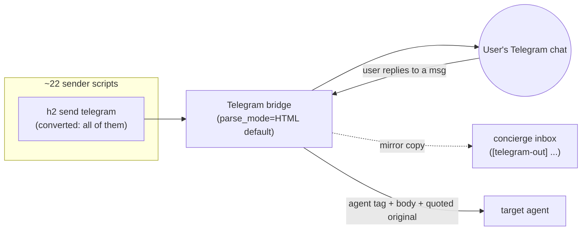

# Design Doc: Telegram routing, formatting & reply-context

Status: DRAFT (planning) — 2026-08-21
Owner: concierge → scheduler (execution)
Related: `internal/bridge/telegram/{telegram.go,rich.go}`, `~/h2home/bin/*` sender scripts
Requested by user (2026-08-21), three asks:
1. All notification scripts render **formatted** (user confirmed **HTML / format "B"** is the one that renders).
2. All outbound to the Telegram chat should **go through concierge**, so concierge knows what the user has received in their chat.
3. Add **reply-context**: when the user replies to a Telegram message, the agent receives **both** the user's new text **and** the message being replied to. (Verify feasibility first — it is feasible, see §3.)

## 1. Summary & root cause

There are ~22 places that push to the user's Telegram chat. They fall into two groups:

- **7 scripts use `h2 send telegram`** → visible to the bridge, but the bridge sends
  them **without `parse_mode`**, so `**bold**` / `<b>` print raw. These need HTML.
  (`window-experiment-poll`, `mcp-auth-alert`, `telegram-reply-guard`,
  `eafieldnotes-weekly-stats`, `context-fresh-notify`, `gh-activity-monitor`,
  `coaching-checkin`.)
- **~14 scripts POST directly to `api.telegram.org`** → **bypass h2 entirely**:
  the bridge never sees them, concierge never sees them, and formatting is
  per-script and inconsistent. (`bridge-watchdog`, `eafieldnotes-weekly-pulse`,
  `cax11-try-once`, `concierge-redeploy.sh`, `pulse-meta-agent`,
  `health-nuisance-alert`, `concierge-restart-resume.sh`, `slskd-watchdog`,
  `pr-notify`, `visual-verify`, `eafieldnotes-amazon-check`, `btc-alert`,
  `reply-guard-healthcheck`, `jaktformidling-weekly-pulse`.)

This split is the whole problem. The fix is one structural move: **make the
Telegram bridge the single choke point for all outbound**, apply HTML by default
at the bridge, and **mirror every outbound to concierge**. All three asks fall out
of this.

## 2. Architecture decision: choke-point + mirror (not concierge-as-relay)

Two candidate models for "route through concierge":

| Model | How | Verdict |
|---|---|---|
| **Concierge-as-relay** | every script `h2 send concierge`, concierge formats + forwards to telegram | ❌ Makes concierge a hard runtime dependency for `btc-alert`, `slskd-watchdog`, etc. Concierge restart/busy = dropped notifications. Burns Opus cycles on every cron ping. |
| **Bridge choke-point + mirror** (chosen) | every script `h2 send telegram`; bridge applies HTML + **also drops a copy into concierge's inbox** | ✅ Concierge sees everything without being a single point of failure. Formatting enforced in one place. Notifications survive concierge downtime. |

We adopt **choke-point + mirror**. Concierge gets full awareness ("what did the
user receive") via a passive mirror, and the bridge stays the reliable path.



## 3. The three deliverables (concrete change-points)

### 3a. Bridge: HTML by default + outbound mirror to concierge
File: `internal/bridge/telegram/telegram.go` (+ `rich.go`).
- `Send`/`sendMessage` sets `parse_mode=HTML` by default (rich.go already knows
  the HTML path — confirm and make it the default for plain `h2 send telegram`).
  Sanitize/escape text that isn't already tagged so stray `<`/`&` don't 400.
- On every successful outbound send, enqueue a mirror copy to the `concierge`
  agent message queue, tagged (e.g. `[telegram-out] <text>`), best-effort /
  non-blocking (mirror failure must never block or fail the user-facing send).
- Config knob to name the mirror target (default `concierge`); empty disables.

### 3b. Reply-context passthrough (FEASIBLE — data already parsed)
File: `internal/bridge/telegram/telegram.go` inbound loop (~line 136-141).
Today: `agent, body := bridge.ParseAgentPrefix(...)`; `ReplyToMessage` is only
mined for an agent tag; `handler(agent, body)` forwards **body only**.
Change: when `u.Message.ReplyToMessage != nil`, prepend the replied-to text as
quoted context to `body`, e.g.:
```
[in reply to]
> <original message text, truncated/blockquoted>

<user's new text>
```
`message.ReplyToMessage.Text` is already in the struct (telegram.go:224). No
Telegram API change needed — the reply payload is in the same `getUpdates`
response. Strip any `[h2 message from: ...]` / agent-tag prefix from the quoted
original so it reads cleanly.

### 3c. Convert all senders → `h2 send telegram`, HTML markup
- Rewrite the ~14 direct-POST scripts to call `h2 send telegram` (bridge now adds
  parse_mode, so they stop hand-rolling curl + parse_mode). Keep `sendDocument`
  (file attachments) as-is where the bridge has no equivalent — but route the
  accompanying text/caption through the bridge, or add a bridge file path.
- Convert `**bold**`/markdown in the 7 `h2 send telegram` scripts to HTML tags
  (`<b>`, `<i>`, `<code>`, `<pre>`, `<blockquote>`).
- Inventory + checklist of all 22 lives in the epic; each script verified to
  render by sending one live test line to the chat.

## 4. Testing

Unit (`go test ./internal/bridge/telegram/...`, rolls into `make test`, CI PR):
- `telegram_test.go`: default `parse_mode=HTML` on send; HTML-escape of untagged
  special chars; mirror copy enqueued to concierge on send; mirror failure does
  **not** fail the user send (inject a failing mirror sink).
- reply-context: given an update with `ReplyToMessage`, `handler` receives body
  containing both the quoted original and the new text; given no reply, body
  unchanged. Extend the existing `ReplyToMessage` test at
  `telegram_test.go:267`.
- Use `setupFakeHome(t)` + `config.CheckTestIsolation()` — never touch real
  config dir (repo CLAUDE.md testing rule).

Integration / manual QA (on-demand):
- Live: run each converted script once, confirm it renders formatted in the chat
  and a `[telegram-out]` mirror lands in concierge's inbox (`h2 peek concierge`).
- Live: reply to a bot message in Telegram, confirm the answering agent quotes
  the original + sees the new text.

## 5. Rollout & coordination hazard

- Branch off the current tip. **HAZARD:** the working tree currently has
  **uncommitted WIP** on `fix/stdin-unknown-stream-open` touching
  `internal/session/message/protocol.go`, `internal/config/session_dir.go`, and
  the claude `settings.json` templates — this is adjacent send/stdin work by
  another session. The scheduler must identify the owner (h2 message) and
  sequence/branch so this work does not stomp it. Do **not** blind-commit the tree.
- `make check` + `make test` green before each commit; `go build -buildvcs=false`
  (repo git hazard); install `~/go/bin/h2`; restart bridge (idempotent systemd).
- PR-first to `hegelstad/h2`; never merge to main directly. Reviewer pass before close.

## 6. Signoff gate
Epic closes only when: all 22 senders render formatted (verified live), mirror
lands in concierge for a sample from each sender class, reply-context verified
live, unit tests green in `make test`, PR opened and reviewed.
