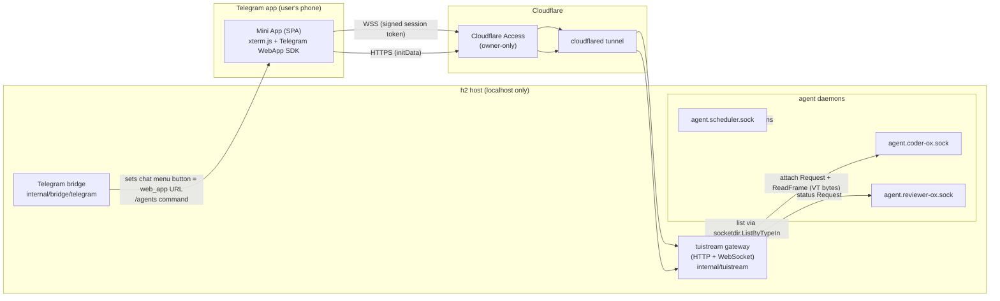

# Telegram TUI Mini App — live agent terminal streaming

**Status:** DESIGN (not for implementation yet). Execution is gated — see
[§14 Sequencing & gating](#14-sequencing--gating). Do not start coding until an
Ox scheduler is standing in the pod and the coordinated opencode→crush cutover
is fully done.

**Owner:** concierge (design) → Ox pod (implementation, non-sensitive infra, Ox lane).
**Reviewers:** reviewer-ox (design review → `-review.md`).

---

## 1. Summary

Give the user a **Telegram Mini App** that (a) lists the currently running h2
agents and (b) lets them "peek" into any one of them and watch its **live TUI**
— the real terminal screen, colours, scrollback, streamed in real time — and
optionally send keystrokes back.

The key enabler already exists in h2: `h2 attach <name>` dials the agent's Unix
socket, sends a `message.Request{Type:"attach", Cols, Rows, …}`, and then
receives a live stream of `FrameTypeData` frames whose payload is **raw VT/ANSI
terminal bytes** (`internal/session/message/protocol.go`: `FrameTypeData=0x00`,
`FrameTypeControl=0x01`, `ReadFrame`/`WriteFrame`). That is exactly the byte
stream a browser terminal emulator (**xterm.js**) consumes. So the feature is a
**bridge**: attach-socket → WebSocket → xterm.js in a Telegram Mini App.

We deliberately choose **only the live-interactive Mini App path** (option #3
from the feasibility note). We are *not* building the periodic-PNG or
text-snapshot fallbacks — they hit the 30 req/s Bot API edit ceiling and never
feel live. The WebSocket path has no such ceiling.

### Why this is safe to build cheaply
- We already own the streaming protocol (`attach`) and a headless VT byte
  stream — no new agent-side work.
- We already run **cloudflared** (see the home-in-cloud setup) so we have an
  HTTPS origin for the Mini App with **Cloudflare Access** in front as
  defense-in-depth.
- The Telegram bridge (`internal/bridge/telegram/telegram.go`) already
  long-polls `getUpdates` and can run commands (`execAndReply`), so wiring a
  menu button / `/agents` entry point is a small extension.

---

## 2. Goals / non-goals

**Goals**
- G1. List running agents (name, role, harness, state, uptime) in the Mini App.
- G2. Open one agent and see its **live** TUI at interactive latency (< ~250 ms
  glass-to-glass on a normal connection).
- G3. Correct rendering: 256-colour/truecolor, box-drawing, cursor, resize,
  scrollback — i.e. a real terminal, not a text dump.
- G4. Optional **interactive input** (send keystrokes to the PTY), OFF by
  default, behind an explicit per-session toggle.
- G5. Owner-only. Only the user's own Telegram identity may reach any of this.
- G6. Zero secret leakage: the channel is owner-only and end-to-end encrypted
  (Telegram TLS + our TLS); no frames persisted server-side.

**Non-goals**
- N1. Multi-user / sharing / RBAC beyond a single-owner allowlist (future).
- N2. The PNG/text snapshot fallbacks (explicitly dropped).
- N3. Replacing `h2 attach` on the desktop — this is additive.
- N4. Editing agent config from the Mini App (view + keystrokes only).

---

## 3. Architecture



**Two planes:**
- **Control plane (HTTPS/JSON):** `GET /api/agents` → list; issue short-lived
  signed **session tokens** after validating Telegram `initData`.
- **Data plane (WebSocket, binary):** one WS per open agent. Server side dials
  the agent socket, sends the `attach` request, and pumps `FrameTypeData`
  payloads straight to the client as binary WS frames. Client→server text/binary
  WS frames carry keystrokes (only if interactive mode is armed) and resize
  events, which the gateway turns into PTY input / `FrameTypeControl` resize.

### 3.1 Live-stream sequence

```mermaid
sequenceDiagram
  participant U as User (Mini App)
  participant G as tuistream gateway
  participant S as agent socket

  U->>G: GET /api/agents (Telegram initData in header)
  G->>G: validate initData HMAC, check owner allowlist
  G->>G: socketdir.ListByTypeIn(TypeAgent) + status Request per agent
  G-->>U: [{name, role, harness, state, uptime}]
  U->>G: WS /api/attach?agent=coder-ox (Sec-WebSocket-Protocol = session token)
  G->>G: verify session token (bound to owner + short TTL)
  G->>S: dial agent.coder-ox.sock; SendRequest(attach, Cols,Rows)
  loop live
    S-->>G: ReadFrame → FrameTypeData (VT bytes)
    G-->>U: WS binary frame (VT bytes)
    U->>U: xterm.write(bytes)
  end
  opt interactive armed
    U->>G: WS binary frame (keystrokes)
    G->>S: forward as PTY stdin
  end
  opt resize
    U->>G: WS text frame {"resize":{cols,rows}}
    G->>S: FrameTypeControl resize
  end
```

---

## 4. Security (first-class — this is the crux)

A Mini App is a public web page and this exposes a **live host terminal**. If
the wrong person reaches it, they see everything the agents see (possibly
secrets in-frame) and, with input armed, can run arbitrary commands. Security is
the reason "the plan is everything" here. Layered controls, all required:

1. **Telegram `initData` validation (authN).** Every HTTP request and the WS
   upgrade carry Telegram `initData`. The gateway validates the HMAC-SHA256
   signature using the bot token (secret key = `HMAC_SHA256("WebAppData",
   bot_token)`), and rejects if the signature is invalid or `auth_date` is older
   than a short window (replay protection). Bot token sourced from
   `~/h2home/.secrets.env` via `telegram-env.sh` — never from `config.yaml`,
   never logged.
2. **Owner allowlist (authZ).** The validated `user.id` must equal the single
   configured owner Telegram id (`tuistream.owner_telegram_id`). Everyone else:
   403, logged. No open registration, ever.
3. **Cloudflare Access in front (defense-in-depth).** The tunnel hostname sits
   behind Cloudflare Access (existing setup) so even an unauthenticated probe
   never reaches the gateway. The gateway additionally **binds to 127.0.0.1**
   only; it is reachable *only* through cloudflared.
4. **Short-lived signed session tokens.** `GET /api/session` (after initData
   validation) returns a token (HMAC over `owner_id|agent-scope|exp`, TTL ~60 s,
   single-use for the WS upgrade). The WS handshake requires it. initData is not
   replayed onto the long-lived WS.
5. **Read-only by default; input is opt-in + armed.** A fresh session cannot
   send keystrokes. The user must explicitly toggle "interactive" in the Mini
   App, which requests an `input`-scoped session token; the gateway refuses PTY
   writes on a read-only session. Rationale: viewing is low-risk; injecting into
   a coder agent's PTY is arbitrary code execution.
6. **No persistence.** Frames are streamed, never written to disk. No scrollback
   is stored server-side. Logs record connect/disconnect/agent/owner + errors
   only — never frame content.
7. **Resource caps.** Max concurrent WS (e.g. 3), idle timeout (e.g. 5 min no
   client activity → close), per-frame size cap (reuse the `maxJSONLine`-style
   bound), backpressure (drop-to-latest coalescing on slow clients, see §12).
8. **Cross-origin hardening.** Telegram's July-2026 Mini App cross-origin
   hardening is respected; the gateway sets strict `Content-Security-Policy`
   (self + Telegram origins only), `X-Frame-Options`/`frame-ancestors` limited
   to Telegram, and rejects WS `Origin` values that aren't Telegram/our host.

**Threat model note.** In-frame secrets can't be scrubbed (the terminal shows
what the agent shows). The control is therefore *channel confidentiality +
owner-only access*, not content filtering. That is acceptable because the
channel is single-owner and end-to-end TLS. This is called out so reviewers
weigh it explicitly.

---

## 5. Module structure & import flow

```
internal/tuistream/                 # new; the gateway
  gateway.go        # HTTP mux + WS upgrade; owns lifecycle
  auth.go           # initData HMAC validation, allowlist, session tokens
  agents.go         # list via socketdir.ListByTypeIn + per-agent status Request
  attachconn.go     # dials agent socket, attach Request, pumps ReadFrame frames
  wsproxy.go        # WS <-> attachconn bridge (coalescing, resize, input gating)
  config.go         # tuistream config block parsing
  webapp/           # static Mini App assets (built)
    index.html
    app.js          # xterm.js + @xterm/addon-fit + Telegram WebApp SDK glue
    style.css
webapp-src/                          # Mini App source (if a build step is used)
```

**Import rules**
- `internal/tuistream` imports `internal/socketdir` and
  `internal/session/message` (for `Request`, `FrameType*`, `ReadFrame`,
  `WriteFrame`, `SendRequest`). It does **not** import the bridge.
- `internal/bridge/telegram` gains only a tiny addition (menu button / `/agents`
  entry) and does **not** import `internal/tuistream`. Both are wired together
  at the top level (cmd) via config, not by cross-import.
- The gateway is started as part of the same process that hosts bridges (see
  `internal/bridgeservice`), or as a dedicated `h2 tuistream` subcommand — TBD
  in review (§16 Q1).

---

## 6. Interfaces

### 6.1 HTTP (control plane)
- `GET /` → serves the Mini App SPA (static).
- `GET /api/agents` → `200 [{name, role, harness, state, uptime_s}]`.
  Requires valid initData header `X-Telegram-Init-Data`. Source: same data
  `h2 list` uses (`socketdir.ListByTypeIn(TypeAgent)` + status `Request`).
- `POST /api/session` body `{agent, mode:"view"|"input"}` → `{token, exp}`.
  Requires valid initData + owner allowlist. `mode:"input"` only if interactive
  is permitted.

### 6.2 WebSocket (data plane)
- `GET /api/attach?agent=<name>` upgraded to WS. Auth: session token in
  `Sec-WebSocket-Protocol` (or first message). Server verifies token scope.
  - **server→client**: binary frames = raw VT bytes (verbatim `FrameTypeData`
    payloads).
  - **client→server**:
    - binary frame = keystrokes → PTY stdin (only if token scope=`input`).
    - text frame `{"resize":{"cols":C,"rows":R}}` → `FrameTypeControl` resize.
    - text frame `{"ping":ts}` → keepalive.

### 6.3 Agent socket (reused, unchanged)
- `message.Request{Type:"attach", Cols, Rows, OscFg, OscBg, ColorFGBG}` then
  `message.ReadFrame` loop (`FrameTypeData` / `FrameTypeControl`). Identical to
  what `internal/cmd/attach.go` already does — the gateway is essentially a
  headless `attach` client that re-emits over WS.

### 6.4 Telegram wiring
- Bridge sets the chat **menu button** to a `web_app` pointing at the tunnel
  URL (via `setChatMenuButton`), and/or handles a `/agents` command that replies
  with an inline `web_app` button. Agent selection then happens **inside** the
  SPA (list screen → terminal screen), so no per-agent Telegram buttons needed.

---

## 7. Mini App (frontend)

- **Stack:** vanilla + `@xterm/xterm` + `@xterm/addon-fit` +
  `telegram-web-app.js` (WebApp SDK). No heavy framework — keep the bundle tiny
  and CSP-friendly.
- **Screens:** (1) *Agent list* — cards from `/api/agents`, pull-to-refresh,
  colour-coded state. (2) *Terminal* — full-screen xterm.js
  (`requestFullscreen`, respect `safeAreaInset`), a header with agent name +
  state + an **Interactive** toggle (armed = red), back button.
- **Lifecycle:** `Telegram.WebApp.ready()`, pass `initData` verbatim to the
  backend, open WS on entering a terminal, `fit()` on resize + send resize,
  close WS on leaving. Keyboard input captured by xterm and sent only when
  armed.
- **Reference implementation** for the exact WS↔xterm.js↔Telegram-Mini-App
  shape: the public `eazy-ssh` project (Mini App + Go backend + xterm.js).

---

## 8. Config additions (`config.yaml`)

```yaml
tuistream:
  enabled: true
  bind: "127.0.0.1:8781"        # localhost only; exposed via cloudflared
  public_url: "https://tui.<tunnel-host>"   # Mini App origin (behind CF Access)
  owner_telegram_id: 123456789  # single owner allowlist
  allow_input: false            # master switch for interactive mode
  max_sessions: 3
  idle_timeout_s: 300
  session_token_ttl_s: 60
```
Bot token is **not** here — validation reads it from the same secret source the
bridge uses.

---

## 9. Testing

Per repo rule: no test may touch the real config dir; use `setupFakeHome(t)` +
`config.ResetResolveCache()`.

### 9.1 Unit (live in `internal/tuistream/*_test.go`; roll up into `make test`)
- `auth_test.go`: initData HMAC validation — valid vector passes; tampered
  hash, expired `auth_date`, wrong bot token, non-owner id all reject. Session
  token issue/verify, scope enforcement (view token can't write), TTL expiry,
  single-use.
- `agents_test.go`: list assembly from a fake socket dir with stub agent
  sockets; state/uptime mapping.
- `wsproxy_test.go`: with an in-memory fake agent socket that emits scripted
  `FrameTypeData`/`FrameTypeControl` frames — assert bytes arrive verbatim at
  the WS client; resize forwarded as control frame; input dropped on view scope
  and forwarded on input scope; per-frame size cap enforced; idle timeout
  closes.
- `config_test.go`: parse/validate the `tuistream` block, defaults, bad values.

### 9.2 Component (in `internal/tuistream/`; `make test`)
- Spin the real gateway `httptest.Server` + a **fake agent socket** (a
  goroutine speaking the `attach` protocol via `message.WriteFrame`). Drive a
  real WS client (nhooyr/coder websocket) through the full handshake →
  stream → resize → input path. Assert end-to-end byte fidelity and that
  auth gates hold.

### 9.3 Integration (in `e2etests/tuistream/`; `make test-external` or a new
`make test-tuistream`)
- Launch a real throwaway h2 agent running a tiny TUI program (prints a known
  ANSI pattern, echoes stdin), attach through the gateway over a real WS, and
  assert the rendered cell grid (parse VT with a headless emulator like
  `hinshun/vt10x`) matches the expected screen. This is the "does the real
  terminal actually render" gate.

### 9.4 Manual QA (pre-release checklist, human judgement)
- On a phone: open Mini App, list shows live agents, open one, confirm the TUI
  looks right (colours, box-drawing, cursor, a `vim`/`htop`-style full-screen
  app), scrollback works, resize on rotate works, latency feels live.
- Arm interactive, type a harmless command, confirm it lands; disarm, confirm
  keystrokes are ignored.
- Negative: open the `public_url` from a non-owner Telegram account / a plain
  browser → blocked at Cloudflare Access and at initData validation.

---

## 10. URP (Unreasonably Robust Programming) — concrete commitments

- **U1. Property test: byte fidelity.** Generator produces random VT byte
  streams (including split multi-byte escape sequences across frame
  boundaries); property: the concatenation of WS payloads received equals the
  concatenation of `FrameTypeData` payloads sent, for any framing. Lives in
  `wsproxy_test.go`, `make test`.
- **U2. Fuzz the initData validator.** `FuzzValidateInitData` in `auth_test.go`
  — never panics, never accepts a payload whose HMAC doesn't verify. Roll into
  `make test` (short) + nightly `-fuzztime` (on-demand target `make fuzz`).
- **U3. Auth state machine is total.** Model session lifecycle
  (unauth→authed→view→input→closed) and assert every transition is explicit;
  illegal transitions (write on view, reuse of a spent token) are rejected with
  a typed error. Covered in `auth_test.go`.
- **U4. Graceful degradation.** If an agent socket dies mid-stream, the WS sends
  a typed close reason and the Mini App shows "agent ended", not a hang.
  Asserted in `wsproxy_test.go`.

## 11. Alien Artifacts

- **A1. Terminal-diff coalescing.** Under backpressure, instead of dropping raw
  bytes (which corrupts VT state), maintain a headless emulator server-side and
  emit a **minimal screen-diff** (changed cell rects) computed against the last
  acknowledged client frame — analogous to how `mosh` uses SSP. Bounded,
  state-correct catch-up for slow mobile links. (Commit: only if §12 measurement
  shows raw coalescing corrupts under loss; otherwise cut. Property test would
  assert diff-applied screen == authoritative screen.)

## 12. Extreme Optimization — concrete commitments

- **E1. Binary WS, zero re-encode.** `FrameTypeData` payloads are forwarded as
  binary WS frames with no base64/JSON wrapping — one `copy`, no allocation per
  frame beyond the read buffer (reuse a pooled buffer).
- **E2. Latest-wins coalescing on slow clients.** A per-connection ring buffer
  coalesces bursts so a slow phone gets the newest screen state, not a growing
  backlog; measured via a synthetic slow-client benchmark
  (`BenchmarkWSProxyBackpressure`) reporting added latency and dropped-byte
  count. Target: < 250 ms added latency at 3 Mbps.
- **Measurement:** a `make bench-tuistream` target records glass-to-glass
  latency (fake agent emitting timestamped frames) and throughput; results
  captured in the PR.

---

## 13. Rollout

1. Land the gateway + Mini App behind `tuistream.enabled: false` (dark).
2. Stand up cloudflared route + Cloudflare Access policy for the tunnel host.
3. Enable for owner only, `allow_input: false`, verify §9.4 manual QA.
4. Only then flip `allow_input: true` after the interactive negative tests pass.

---

## 14. Sequencing & gating

**Do not implement until BOTH are true** (user directive, 2026-08-23):
1. An **Ox scheduler** is standing in the crush pod, and
2. the **coordinated opencode→crush cutover is fully complete**.

Rationale: this is meaningful infra and we want the standing pod (with a
scheduler coordinating) to build/run it, not the interim opencode pair mid-swap.
Until then this doc sits in review so the plan is rock-solid and ready to
execute the moment the gate opens. Implementation is **Ox-lane** work
(non-sensitive infra; fine as training data) — assign to the crush pod.

---

## 15. Work breakdown (beads, to create when the gate opens)

- Epic: `telegram-tui-miniapp`.
- T1 gateway skeleton + config + `/api/agents` + auth (initData, allowlist,
  session tokens) + unit/fuzz tests.
- T2 WS data plane: attachconn + wsproxy (stream, resize, input gating,
  coalescing) + component tests. (depends T1)
- T3 Mini App SPA (list + terminal, xterm.js, WebApp SDK, fullscreen). (depends T1)
- T4 Telegram bridge entry (menu button / `/agents`) + config wiring. (depends T1)
- T5 cloudflared route + Cloudflare Access policy + rollout flags. (depends T2,T3)
- T6 e2e + bench + manual-QA checklist. (depends T2,T3)

## 16. Open questions for review

- Q1. Host the gateway inside the bridge-hosting process vs a dedicated
  `h2 tuistream` subcommand? (Lean: dedicated subcommand for isolation.)
- Q2. Serve the SPA from the gateway vs Cloudflare Pages? (Lean: from gateway,
  single origin simplifies CSP + initData.)
- Q3. Do we ever want input at all, or ship view-only v1 and defer §4.5? (Lean:
  ship view-only first; input in a follow-up once negative tests are solid.)
- Q4. WS library choice (`coder/websocket` vs `gorilla`)? (Lean: `coder/websocket`.)

---

*Review docs: `telegram-tui-miniapp-review.md` (reviewer-ox). Test plan:
`telegram-tui-miniapp-testplan.md`.*
